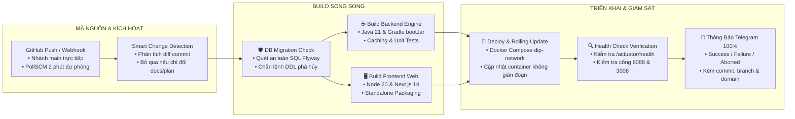

# Micro-Report — Standalone Hybrid Dynamic Report Engine

[](#)
[](#)
[](#)
[](#)

**Micro-Report** là phân hệ **Báo Cáo Động Lai Độc Lập (Standalone Hybrid Dynamic Report Engine)** được phát triển bởi Chapisoft/MASCOM. Hệ thống cho phép doanh nghiệp và các dự án nội bộ (**DIP Platform, Micro-CRM, Natcash**, v.v.) dễ dàng thiết kế, xem trước, xuất dữ liệu lớn và nhúng menu báo cáo động vào hệ thống đích mà không cần viết code cứng.

---

## 🌟 Tính Năng Nổi Bật

1. **Kiến Trúc Độc Lập & Đa Nền Tảng (Standalone Microservice):**
   * Hoạt động như một dịch vụ cắm ghép độc lập, quản lý kết nối CSDL động (PostgreSQL, Oracle, MySQL, SQL Server, ClickHouse).
2. **Đa Người Thuê Tuyệt Đối (Multi-Tenancy Isolation):**
   * Cô lập 100% dữ liệu mẫu báo cáo, datasource và task xuất file theo `TENANT_ID` (DIP_BHXH, MICRO_CRM, NATCASH_PAYMENT...).
3. **Mô Hình Lai Đột Phá (Dual-Mode Builder):**
   * **Chế độ No-Code (Visual GUI Builder):** Kéo thả trường dữ liệu, Visual Join Builder, bộ lọc phân cấp `AND`/`OR`, nút 1-click `Convert GUI to SQL`.
   * **Chế độ Low-Code (Monaco SQL Query Editor):** Soạn thảo SQL chuẩn VS Code, hỗ trợ CTE, Window Functions, nhúng tham số động `{{params.var}}` và hàm biến đổi dữ liệu JavaScript hậu kỳ.
4. **Màn Hình Chạy Báo Cáo Chuyên Dụng (Standalone Report Viewer):**
   * Dành riêng cho Người Dùng Cuối (Kế toán, Quản lý, Giao dịch viên) với form nhập tham số động, bảng dữ liệu chuẩn 4 cột (`Checkbox` -> `STT` -> `Thao tác` -> `Dữ liệu`), ẩn hoàn toàn mã SQL.
5. **Bảo Mật & An Toàn Tuyệt Đối:**
   * `JSqlParser` AST Sandbox chặn 100% các câu lệnh DML/DDL (`INSERT`, `UPDATE`, `DELETE`, `DROP`, `ALTER`, `TRUNCATE`).
   * Bắt buộc kết nối CSDL ở chế độ `isReadOnly = true` và mã hóa mật khẩu AES-256.
6. **Hiệu Năng Xuất Dữ Liệu Lớn (SXSSF Streaming):**
   * Trích xuất file Excel (`.xlsx`) tới 100.000 dòng với RAM footprint < 50MB nhờ Apache POI SXSSF Window 500 dòng.
7. **Đồng Bộ Menu Xuất Bản Tự Động (Published Menu Sync API):**
   * Cho phép Admin hệ sinh thái xuất bản mẫu báo cáo thành các menu con độc lập trên Sidebar của DIP Platform hoặc Micro-CRM.

---

## 💻 HƯỚNG DẪN CHẠY TRỰC TIẾP Ở LOCAL (LOCAL DEVELOPMENT RUN)

### 1. Yêu Cầu Môi Trường Cài Đặt (Prerequisites)
* **Java Development Kit (JDK):** Java 21 LTS (Oracle JDK hoặc Eclipse Temurin)
* **Node.js:** v18.17+ hoặc v20 LTS kèm npm / yarn
* **Docker & Docker Compose:** (Tùy chọn khi muốn chạy trọn gói container)

---

### 2. Chạy Phân Hệ Backend (Spring Boot 3 Engine)
```bash
cd src/backend

# Chạy trực tiếp qua Gradle (Sử dụng CSDL H2 in-memory và tự động seed data V1, V2)
./gradlew bootRun
```
* **REST API Endpoint:** `http://localhost:8080`
* **Swagger UI / OpenAPI Spec:** `http://localhost:8080/swagger-ui.html`
* **Chạy kiểm thử Unit Tests:** `./gradlew test`

---

### 3. Chạy Phân Hệ Frontend (Next.js 14 Web & Embed SDK)
```bash
cd src/frontend

# Cài đặt dependencies
npm install

# Khởi chạy dev server
npm run dev
```
* **Màn Hình Thiết Kế Báo Cáo (Dual-Mode Builder):** `http://localhost:3000/reports/builder`
* **Màn Hình Quản Lý Mẫu Báo Cáo:** `http://localhost:3000/reports/templates`
* **Màn Hình Chạy Báo Cáo Nhúng (Standalone Viewer):** `http://localhost:3000/embed/reports/viewer?tenant=DIP_BHXH&code=RPT_DIP_DOSSIERS_SUMMARY`
* **Trang Đồng Bộ DWH CSDL:** `http://localhost:3000/configs/dwh-sync`

---

### 4. Chạy Toàn Bộ Stack Cục Bộ Bằng Docker Compose
```bash
# Khởi chạy cụm 3 containers: PostgreSQL Metadata DB + Backend Engine + Frontend UI
docker compose -f deploy/docker-compose.yml up -d --build

# Dừng hệ thống
docker compose -f deploy/docker-compose.yml down
```

---

### 5. Kiểm Định Chất Lượng Mã Nguồn Cục Bộ (Pre-Commit Local CI)
Trước khi commit code, chạy script kiểm định 3 tầng (Kiểm tra Mermaid docs, Unit Tests Backend Java 21, ESLint Frontend):
```bash
./scripts/local_ci.sh
```

---

## 🚢 HƯỚNG DẪN DEPLOY TRÊN SERVER DIP PLATFORM (`210.211.102.99`)

### 1. Thông Số Hạ Tầng & Tên Miền Triển Khai
* **Host IP Máy Chủ:** `210.211.102.99` (SSH Port: `65000`)
* **Tên Miền Backend Engine:** `rpe.microtec.vn` (`http://172.18.0.1:8088`)
* **Tên Miền Frontend Web & Embed:** `rpf.microtec.vn` (`http://172.18.0.1:3008`)
* **Mạng Docker Chung:** `dip-network` (kết nối trực tiếp với `db_stack_postgres` và Nginx Gateway)
* **Thư Mục Dữ Liệu Persistent:** `/home/dip/data/report_metadata_db`
* **Thư Mục Ứng Dụng:** `/home/dip/micro-report`

---

### 2. Quy Trình Triển Khai Nhanh 1 Chạm (Automated Deployment)
```bash
# 1. Đăng nhập SSH vào server DIP
ssh -p 65000 -i ~/.ssh/jenkins_deploy_dev dip@210.211.102.99

# 2. Truy cập thư mục dự án (hoặc git pull mã nguồn mới)
cd /home/dip/micro-report
git pull origin main

# 3. Thực thi script deploy tự động đã đóng gói sẵn
./deploy/deploy_dip.sh
```

*Script `deploy_dip.sh` sẽ tự động:*
1. Kết nối vào Docker Network `dip-network`.
2. Tạo thư mục volume `/home/dip/data/report_metadata_db`.
3. Tự động áp dụng các bản di trú Flyway `V1` và `V2` (seed sẵn kết nối CSDL và mẫu báo cáo cho **DIP** và **MICRO-CRM**).
4. Khởi chạy cụm 3 containers với cấu hình limits an toàn:
   * `micro-report-metadata-db` (Port 5432 Internal)
   * `micro-report-backend` (Port 8088:8080 → `rpe.microtec.vn`)
   * `micro-report-frontend` (Port 3008:3000 → `rpf.microtec.vn`)

---

### 3. Cấu Hình Điều Hướng Nginx Virtual Hosts (`host-report-vhost.conf`)
Tập tin cấu hình Nginx được đặt tại `deploy/nginx/host-report-vhost.conf`:

```nginx
# 1. Backend Engine API & Swagger Docs (rpe.microtec.vn)
server {
    listen 80;
    server_name rpe.microtec.vn;
    client_max_body_size 50M;

    location / {
        proxy_pass http://172.18.0.1:8088;
        proxy_set_header Host $host;
        proxy_set_header X-Real-IP $remote_addr;
        proxy_set_header X-Forwarded-For $proxy_add_x_forwarded_for;
        proxy_set_header X-Forwarded-Proto $scheme;
        proxy_read_timeout 120s;
    }
}

# 2. Frontend Web App & Standalone Viewer (rpf.microtec.vn)
server {
    listen 80;
    server_name rpf.microtec.vn;
    client_max_body_size 50M;

    location / {
        proxy_pass http://172.18.0.1:3008;
        proxy_http_version 1.1;
        proxy_set_header Upgrade $http_upgrade;
        proxy_set_header Connection "upgrade";
        proxy_set_header Host $host;
        proxy_set_header X-Real-IP $remote_addr;
        proxy_set_header X-Forwarded-For $proxy_add_x_forwarded_for;
        proxy_set_header X-Forwarded-Proto $scheme;
        proxy_read_timeout 90s;
    }
}
```

Reload Nginx sau khi cập nhật:
```bash
docker exec -it gateway_stack_nginx nginx -t
docker exec -it gateway_stack_nginx nginx -s reload
```

---

## 🔄 QUY TRÌNH CI/CD & JENKINS PIPELINE

Hệ thống được tích hợp quy trình CI/CD tự động hóa hoàn toàn với máy chủ Jenkins (`210.211.102.99`), đồng bộ chuẩn với các phân hệ `micro-crm` và `micro-loyalty`:



### Các Tham Số Build Trên Jenkins
* `TARGET_SERVICE`: Chọn phân hệ cần đóng gói (`all`, `report-backend`, `report-frontend`).
* `SKIP_TESTS`: Bỏ qua kiểm thử đơn vị khi cần hotfix khẩn cấp (mặc định: `false`).

### Tiện Ích Dòng Lệnh Hỗ Trợ
* **Gửi thông báo Telegram:**
  ```bash
  ./scripts/notify_telegram.sh "Nội dung thông báo" "SUCCESS|FAILED|WARNING|INFO"
  ```
* **Kiểm tra sức khỏe dịch vụ:**
  ```bash
  ./scripts/check_health.sh 8088 3008
  ```

---

## 📦 SEED DATA CÓ SẴN TRÊN CƠ SỞ DỮ LIỆU

Hệ thống đã được nạp sẵn cấu hình DataSource và Mẫu báo cáo thực tế cho các hệ thống:

| Hệ Thống (Tenant) | Mã DataSource | Tên DataSource & CSDL Đích | Mẫu Báo Cáo Mặc Định Đã Xuất Bản |
|---|---|---|---|
| **DIP Platform** (`DIP_BHXH`) | `DIP_DWH` | **DIP OLAP Data Warehouse** (`dip_olap`) | • `RPT_DIP_DOSSIERS_SUMMARY` (Tổng hợp hồ sơ)<br/>• `RPT_DIP_COMMISSIONS_AGENT` (Đối soát hoa hồng đại lý)<br/>• `RPT_DIP_DAILY_REVENUE` (Doanh thu theo ngày) |
| **Micro-CRM** (`MICRO_CRM`) | `CRM_DWH` | **Micro-CRM OLAP Database** (`crm_olap`) | • `RPT_CRM_LEADS_BY_SOURCE` (Leads theo nguồn & tỷ lệ chuyển đổi)<br/>• `RPT_CRM_SALES_PIPELINE` (Phễu bán hàng & cơ hội)<br/>• `RPT_CRM_AGENT_PERFORMANCE` (KPI nhân viên) |
| **Natcash** (`NATCASH_PAYMENT`) | `NATCASH_DWH` | **Natcash Payment OLAP DB** (`natcash_db`) | Cấu hình DataSource kết nối sẵn sàng. |
| **Default Sandbox** (`DEFAULT`) | `DEFAULT_DS` | **Embedded H2 In-Memory DB** | Cấu hình thử nghiệm nhanh. |

---

## 📂 Cấu Trúc Thư Mục Repository

```
micro-report/
├── .agents/                                # AI Agent Rules & Specialized Skills
│   ├── AGENTS.md                           # Bộ quy tắc phát triển, coding conventions
│   └── skills/
│       ├── report-engine-writer/           # Backend Spring Boot 3 Engine Skill
│       └── ui-report-builder-writer/       # Frontend UI & Embed SDK Skill
├── docs/                                   # Tài liệu kỹ thuật chi tiết
│   ├── architecture/
│   │   └── DYNAMIC_REPORT_ENGINE.md        # Master Technical Design Document v4.0
│   ├── PROJECT_STATUS.md                   # Báo cáo thực trạng tiến độ & dashboard
│   ├── api/                                # REST API Contracts & OpenAPI spec
│   ├── integration/                        # Hướng dẫn tích hợp cho DIP, Micro-CRM
│   └── assets/images/                      # Wireframe & Architecture diagrams
├── plan/
│   ├── DYNAMIC_REPORT_MASTER_PLAN.md       # Kế hoạch tổng thể 4 Pha (10 ngày)
│   └── DETAIL_PROJECT_PLAN.md              # Kế hoạch phân rã chi tiết WBS & RACI
├── src/
│   ├── backend/                            # Spring Boot 3 Standalone Service (Java 21)
│   ├── frontend/                           # Next.js 14 Standalone Web & Iframe App
│   └── sdk/                                # Reusable React NPM Component Package
├── deploy/                                 # Cấu hình Docker Compose, Dockerfiles & Runbook
│   ├── ci-cd/jenkins/Jenkinsfile           # Cấu hình Jenkins Pipeline dự phòng
│   ├── docker-compose.yml                  # Docker Compose cho môi trường Local
│   ├── docker-compose.dip.yml              # Docker Compose cho máy chủ DIP
│   ├── Dockerfile.backend                  # Dockerfile tối ưu Spring Boot 3
│   ├── Dockerfile.frontend                 # Dockerfile tối ưu Next.js Standalone
│   ├── deploy_dip.sh                       # Script tự động hóa deploy lên server DIP
│   ├── DEPLOYMENT_PLAN_DIP.md              # Kế hoạch triển khai & kịch bản smoke tests
│   └── nginx/host-report-vhost.conf        # Cấu hình Reverse Proxy Nginx Gateway
├── scripts/
│   ├── check_health.sh                     # Script kiểm tra sức khỏe backend & frontend
│   ├── export_docx.js                      # Script xuất tài liệu Markdown sang Docx
│   ├── local_ci.sh                         # Script kiểm thử chất lượng trước khi commit
│   └── notify_telegram.sh                  # Script gửi thông báo Telegram
├── Jenkinsfile                             # Jenkins Declarative CI/CD Pipeline
├── package.json                            # Root Monorepo Scripts
└── README.md
```

---

## 📖 Tài Liệu Tham Chiếu Chi Tiết

* 📘 [Tài Liệu Thiết Kế Kỹ Thuật Tổng Thể (Master Architecture)](docs/architecture/DYNAMIC_REPORT_ENGINE.md)
* 📋 [Kế Hoạch Triển Khai Tổng Thể (Master Plan)](plan/DYNAMIC_REPORT_MASTER_PLAN.md)
* 📊 [Kế Hoạch Triển Khai Chi Tiết (WBS Detail Plan)](plan/DETAIL_PROJECT_PLAN.md)
* 🚦 [Báo Cáo Thực Trạng Tiến Độ Dự Án (Project Status)](docs/PROJECT_STATUS.md)
* 🔌 [Hướng Dẫn Tích Hợp Đa Nền Tảng & Xuất Bản Menu Riêng (Integration Guide)](docs/integration/CMS_REPORT_INTEGRATION_GUIDE.md)
* 🚢 [Phương Án & Kịch Bản Deploy Chi Tiết Trên Server DIP (Deployment Runbook)](deploy/DEPLOYMENT_PLAN_DIP.md)
* ⚙️ [Quy Chuẩn Phát Triển & Workspace Rules](.agents/AGENTS.md)