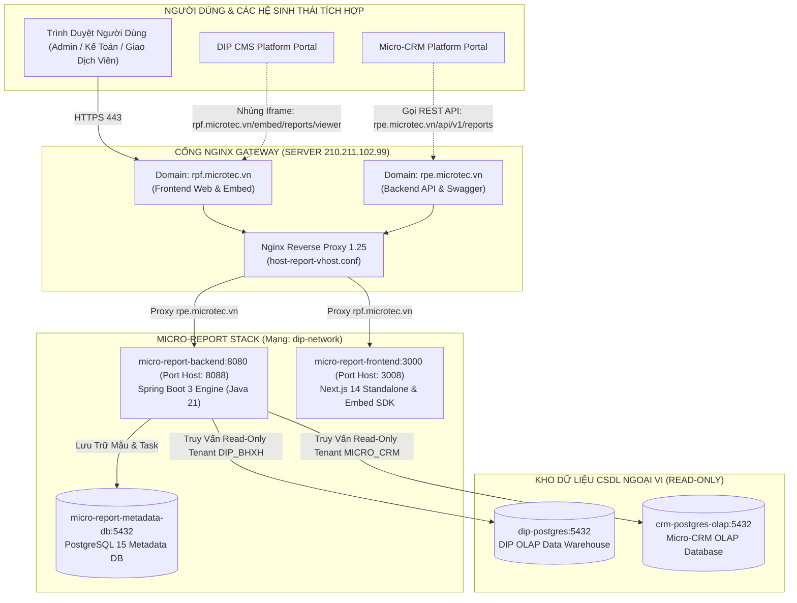

# KẾ HOẠCH & PHƯƠNG ÁN DEPLOY PHÂN HỆ MICRO-REPORT LÊN SERVER DIP
## (DIP SERVER DEPLOYMENT PLAN & ARCHITECTURE SPECIFICATION)

**Dự án:** Phân hệ Báo Cáo Động Độc Lập (Micro-Report Engine)  
**Mục tiêu:** Triển khai độc lập phân hệ Báo Cáo Động lên máy chủ DIP Platform (`210.211.102.99`)  
**Tên Miền Triển Khai (Production Domains):**
* 🌐 **Backend Engine API & Swagger UI:** `rpe.microtec.vn`
* 🌐 **Frontend Web App & Embed SDK:** `rpf.microtec.vn`  
**Mã tài liệu:** `DEPLOY-202608-MASCOM-MR-DIP`  
**Phiên bản:** 2.0  
**Ngày cập nhật:** 21/08/2026  
**Đơn vị thực hiện:** DevOps & Architecture Team MASCOM / Chapisoft  

---

## 1. TỔNG QUAN HẠ TẦNG & MÔ HÌNH TRIỂN KHAI TRÊN SERVER DIP



---

## 2. THÔNG SỐ CẤU HÌNH CÁC CONTAINER TRÊN SERVER DIP

| Tên Container | Image / Base | Cổng Host : Container | Giới Hạn Tài Nguyên (Limits) | Thư Mục Mount Dữ Liệu | Tên Miền / Chức Năng |
|---|---|:---:|:---:|---|---|
| **`micro-report-metadata-db`** | `postgres:15-alpine` | `5432` (Internal) | `0.5 CPU` • `512MB RAM` | `/home/dip/data/report_metadata_db` | Lưu trữ cấu hình DataSource, mẫu báo cáo, tenant, task export và shedlock. |
| **`micro-report-backend`** | `eclipse-temurin:21-jre-alpine` | `8088 : 8080` | `1.0 CPU` • `1024MB RAM` | `/tmp/report_exports` | **`rpe.microtec.vn`**: Xử lý AST Sandbox, Dynamic HikariPool, SXSSF Streaming Excel và Scheduler. |
| **`micro-report-frontend`** | `node:20-alpine` (Next.js Standalone) | `3008 : 3000` | `0.5 CPU` • `512MB RAM` | Không | **`rpf.microtec.vn`**: Cung cấp giao diện Dual-Mode Builder, Standalone Viewer và Embed routes. |

---

## 3. CẤU HÌNH ĐIỀU HƯỚNG NGINX VIRTUAL HOSTS (`host-report-vhost.conf`)

Tập tin cấu hình Virtual Hosts được đặt tại `deploy/nginx/host-report-vhost.conf` và nạp vào máy chủ Nginx Gateway:

```nginx
# ==============================================================================
# Host Nginx Virtual Host Configuration — Micro-Report Platform
# Backend Engine Domain: rpe.microtec.vn (Spring Boot 3 REST Engine & Swagger UI)
# Frontend Web Domain:   rpf.microtec.vn (Next.js 14 Builder & Standalone Viewer)
# ==============================================================================

# ── 1. Backend Engine API & OpenAPI Docs (rpe.microtec.vn) ───────────────────
server {
    listen 80;
    listen [::]:80;
    server_name rpe.microtec.vn;

    access_log /var/log/nginx/micro_report_backend_access.log;
    error_log /var/log/nginx/micro_report_backend_error.log;

    client_max_body_size 50M;

    # Giao diện Swagger UI & OpenAPI Specification
    location /swagger-ui/ {
        proxy_pass http://172.18.0.1:8088/swagger-ui/;
        proxy_http_version 1.1;
        proxy_set_header Host $host;
        proxy_set_header X-Real-IP $remote_addr;
        proxy_set_header X-Forwarded-For $proxy_add_x_forwarded_for;
        proxy_set_header X-Forwarded-Proto $scheme;
    }

    location /v3/api-docs {
        proxy_pass http://172.18.0.1:8088/v3/api-docs;
        proxy_http_version 1.1;
        proxy_set_header Host $host;
        proxy_set_header X-Real-IP $remote_addr;
        proxy_set_header X-Forwarded-For $proxy_add_x_forwarded_for;
        proxy_set_header X-Forwarded-Proto $scheme;
    }

    # RESTful API Engine (Query, Template CRUD, SXSSF Streaming Export)
    location / {
        proxy_pass http://172.18.0.1:8088;
        proxy_http_version 1.1;
        proxy_set_header Host $host;
        proxy_set_header X-Real-IP $remote_addr;
        proxy_set_header X-Forwarded-For $proxy_add_x_forwarded_for;
        proxy_set_header X-Forwarded-Proto $scheme;
        
        # Tăng timeout cho các tác vụ trích xuất dữ liệu lớn SXSSF Streaming
        proxy_connect_timeout 60s;
        proxy_read_timeout 120s;
        proxy_send_timeout 120s;
        
        proxy_buffer_size 128k;
        proxy_buffers 4 256k;
        proxy_busy_buffers_size 256k;
    }
}

# ── 2. Frontend Web App, Standalone Viewer & Embed SDK (rpf.microtec.vn) ─────
server {
    listen 80;
    listen [::]:80;
    server_name rpf.microtec.vn;

    access_log /var/log/nginx/micro_report_frontend_access.log;
    error_log /var/log/nginx/micro_report_frontend_error.log;

    client_max_body_size 50M;

    location / {
        proxy_pass http://172.18.0.1:3008;
        proxy_http_version 1.1;
        proxy_set_header Upgrade $http_upgrade;
        proxy_set_header Connection "upgrade";
        proxy_set_header Host $host;
        proxy_set_header X-Real-IP $remote_addr;
        proxy_set_header X-Forwarded-For $proxy_add_x_forwarded_for;
        proxy_set_header X-Forwarded-Proto $scheme;
        
        proxy_read_timeout 90s;
        proxy_buffer_size 128k;
        proxy_buffers 4 256k;
        proxy_busy_buffers_size 256k;
    }
}
```

---

## 4. QUY TRÌNH THỰC HIỆN DEPLOY CHI TIẾT (STEP-BY-STEP RUNBOOK)

### Bước 1: Chuẩn Bị & Đẩy Mã Nguồn Lên Máy Chủ DIP
1. Đăng nhập SSH vào server DIP:
   ```bash
   ssh -p 65000 -i ~/.ssh/jenkins_deploy_dev dip@210.211.102.99
   ```
2. Truy cập thư mục ứng dụng `/home/dip/micro-report` và cập nhật nhánh `main`.

---

### Bước 2: Thực Thi Deploy Bằng Script Tự Động Hóa 1 Chạm
Chạy lệnh triển khai:
```bash
./deploy/deploy_dip.sh
```

---

### Bước 3: Kịch Bản Kiểm Thử Hậu Triển Khai (Smoke Testing Matrix)

| STT | Endpoint / URL Kiểm Thử | Phương Thức | Kết Quả Mong Đợi |
|:---:|---|:---:|---|
| 1 | `http://localhost:8088/actuator/health` | GET | Status `UP` |
| 2 | `http://localhost:8088/api/v1/reports/datasources` | GET (`X-Tenant-Id: DIP_BHXH`) | Trả về danh sách DataSource của DIP |
| 3 | `http://localhost:8088/api/v1/reports/datasources?listDatasource=DIP_DWH` | GET (`X-Tenant-Id: DIP_BHXH`) | Chỉ trả về `DIP_DWH` |
| 4 | `http://localhost:8088/api/v1/reports/templates/published` | GET (`X-Tenant-Id: DIP_BHXH`) | Trả về danh sách 3 mẫu báo cáo đã xuất bản |
| 5 | `http://localhost:3008/embed/reports/viewer?tenant=DIP_BHXH` | GET | HTTP 200, hiển thị giao diện Standalone Viewer |
| 6 | `http://localhost:3008/reports/builder` | GET | HTTP 200, hiển thị giao diện Dual-Mode Builder |

---

## 5. KẾ HOẠCH DỰ PHÒNG & ROLLBACK (ROLLBACK PROCEDURE)

Nếu phát sinh sự cố trong quá trình triển khai:
1. Quay về commit ổn định trước đó: `git checkout <commit_id>`.
2. Khởi động lại service bằng Docker Compose:
   ```bash
   docker compose -f deploy/docker-compose.dip.yml down
   docker compose -f deploy/docker-compose.dip.yml up -d
   ```
3. Dữ liệu PostgreSQL Metadata được bảo toàn nguyên vẹn tại thư mục `/home/dip/data/report_metadata_db`.
