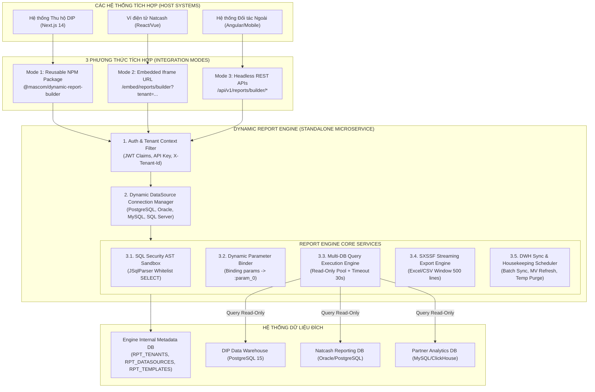
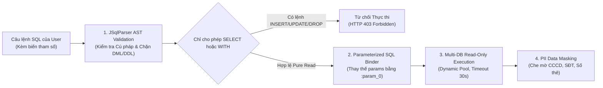
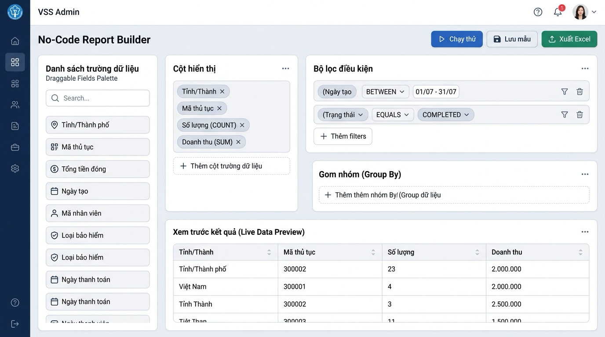
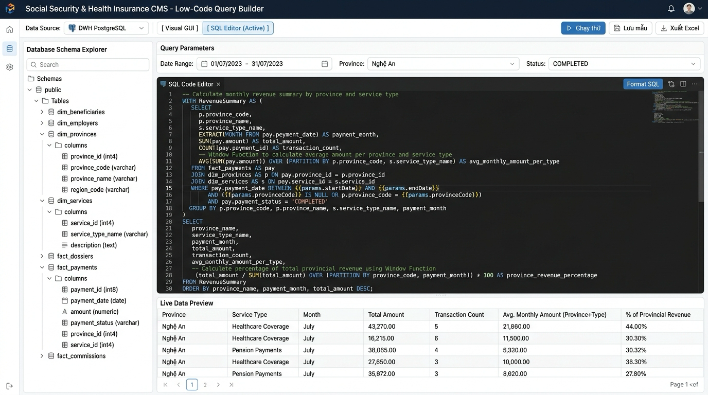

# BÁO CÁO TỔNG HỢP PHÂN TÍCH & GIẢI PHÁP KỸ THUẬT: PHÂN HỆ BÁO CÁO ĐỘNG ĐỘC LẬP (STANDALONE DYNAMIC REPORT ENGINE)

**Dự án:** Nền tảng Báo Cáo Động Đa Nền Tảng (Standalone Dynamic Report Engine)  
**Tài liệu:** Tài liệu Thiết kế Kỹ thuật & Phương án Triển khai Độc Lập (Master Technical Design Document)  
**Phiên bản:** 4.0 (Kiến trúc Dịch vụ Độc lập, Đa Người Thuê Multi-Tenancy & Sẵn sàng Tích hợp Đa Hệ thống)  
**Tác giả:** Đội ngũ Kiến trúc Hệ thống (MASCOM / Chapisoft)  
**Ngày phê duyệt:** 21/08/2026  

---

## 1. TỔNG QUAN & TẦM NHÌN DỊCH VỤ ĐỘC LẬP (STANDALONE ENGINE)

### 1.1. Mục Tiêu Tách Rời & Hoạt Động Độc Lập
Module Báo Cáo Động được thiết kế và đóng gói như một **Dịch Vụ Độc Lập (Standalone Microservice / Pluggable Reporting Engine)**, hoàn toàn phi nghiệp vụ (Domain-Agnostic):
* **Không Phụ Thuộc Vào Nghiệp Vụ Cố Định:** Không hardcode bất kỳ bảng hay cột dữ liệu riêng của một dự án đơn lẻ. Mọi định nghĩa về Bảng, Views, Cột, Kiểu dữ liệu đều được khám phá và ánh xạ động qua **Schema Explorer** từ bất kỳ CSDL nào.
* **Đa Người Thuê (Multi-Tenancy):** Hỗ trợ phục vụ đồng thời nhiều hệ thống khác nhau (`TENANT_ID`: `DIP_BHXH`, `NATCASH_PAYMENT`, `MASCOM_ERP`, `ECOMMERCE_APP`) trên cùng một cụm dịch vụ với không gian cấu hình, phân quyền và dữ liệu hoàn toàn cô lập.
* **Đa Kết Nối CSDL Động (Pluggable DataSource Connectors):** Cho phép cấu hình và quản lý kết nối động đến nhiều loại CSDL khác nhau (PostgreSQL, Oracle, MySQL, SQL Server, ClickHouse, MariaDB) qua API hoặc giao diện quản trị.
* **Sẵn Sàng Tích Hợp Đa Nền Tảng (3 Integration Models):** Cung cấp đồng thời 3 giải pháp tích hợp linh hoạt vào bất kỳ hệ thống chủ nào: **NPM React Component / Micro-Frontend**, **Iframe Embed URL (kèm PostMessage Bridge)**, hoặc **Headless RESTful APIs**.

---

### 1.2. Mô Hình Lai Đột Phá (No-Code GUI + Low-Code SQL Editor)
Lấy cảm hứng từ triết lý của **Lowcoder / Retool / Metabase**:
1. **Chế Độ No-Code (Visual GUI Builder):**
   * **Schema Tree Explorer:** Tự động quét và hiển thị danh mục Bảng, Cột, Kiểu dữ liệu (`STRING`, `NUMERIC`, `DATE`, `ENUM`) từ kết nối CSDL được chọn.
   * **Visual Join Builder:** Cho phép kéo thả liên kết trực quan giữa các bảng (`Table A` JOIN `Table B` ON `a.id = b.a_id`).
   * **Visual Filters & Grouping:** Cấu hình cây điều kiện lọc `AND`/`OR` và các hàm tổng hợp (`SUM`, `COUNT`, `AVG`, `MIN`, `MAX`).
   * **Nút 1-Click "Convert GUI to SQL":** Tự động sinh câu lệnh SQL chuẩn từ giao diện kéo thả để chuyển sang chế độ Low-Code mà không bị mất dữ liệu cấu hình.
2. **Chế Độ Low-Code (Monaco SQL Query Editor & Parameter Binding):**
   * **Trình Soạn Thảo Monaco Editor:** Trình biên tập code chuẩn VS Code có gợi ý cú pháp (IntelliSense), tô màu cú pháp (Highlighting) và tự động căn chỉnh code (`Format SQL`).
   * **Hỗ Trợ Truy Vấn Phân Tích Nâng Cao:** Cho phép viết CTE `WITH ... AS`, Subquery, Window Functions (`SUM() OVER (PARTITION BY ...)`), Xếp hạng (`RANK()`), Điều kiện rẽ nhánh (`CASE WHEN ... THEN`).
   * **Nhúng Tham Số Động `{{params.startDate}}`, `{{params.regionId}}`:** Tự động ánh xạ với các form control trên giao diện người dùng.
   * **Bộ Biến Đổi Dữ Liệu Hậu Kỳ (Post-Processing JS Transformations):** Hỗ trợ viết hàm JavaScript ngắn tính toán các cột công thức động trước khi xuất file.

---

## 2. KIẾN TRÚC TỔNG THỂ & MÔ HÌNH TÍCH HỢP ĐA HỆ THỐNG



---

## 3. CƠ CHẾ BẢO MẬT, XÁC THỰC & PHÂN QUYỀN ĐA HỆ THỐNG (DECOUPLED AUTH & MULTI-TENANCY)

### 3.1. Các Phương Thức Xác Thực (Authentication Strategies):
1. **JWT Trust Mode (Dành cho Web UI / Single Sign-On):**
   * Report Engine xác thực chữ ký JWT của hệ thống chủ thông qua cấu hình `JWKS_URL` (JSON Web Key Set) hoặc Public Key chung.
   * Tự động trích xuất các claims: `tenant_id`, `user_id`, `user_name`, `roles`, `permissions`.
2. **API Key / Service-to-Service Mode (Dành cho Backend-to-Backend):**
   * Cho phép các hệ thống bên ngoài gọi trực tiếp qua Header:
     * `X-Tenant-Id: NATCASH_PROD`
     * `X-API-Key: sec_live_9f8a7b6c5d4e3f2a1`
     * `X-User-Id: 100293`
3. **Chống Leo Thang & Cô Lập Dữ Liệu (Tenant Isolation):**
   * Mọi câu lệnh truy vấn mẫu báo cáo (`RPT_TEMPLATES`), kết nối CSDL (`RPT_DATASOURCES`) và nhật ký xuất file (`RPT_EXPORT_TASKS`) đều bị ép điều kiện lọc `WHERE TENANT_ID = :currentTenantId`.

---

## 4. QUY HOẠCH DATABASE NỘI BỘ CỦA ENGINE (METADATA REPOSITORY)

Engine sở hữu một schema metadata độc lập (có thể lưu trên PostgreSQL hoặc Oracle), hoàn toàn tự động khởi tạo qua Flyway Migration:

```sql
-- 1. BẢNG QUẢN LÝ NGƯỜI THUÊ (TENANTS)
CREATE TABLE RPT_TENANTS (
    TENANT_ID           VARCHAR(50) PRIMARY KEY,
    TENANT_NAME         VARCHAR(255) NOT NULL,
    API_KEY_HASH        VARCHAR(255) NOT NULL,
    STATUS              VARCHAR(20) DEFAULT 'ACTIVE' NOT NULL, -- ACTIVE, SUSPENDED
    MAX_CONCURRENT_JOBS NUMBER(5) DEFAULT 5 NOT NULL,
    CREATED_AT          TIMESTAMP WITH TIME ZONE DEFAULT CURRENT_TIMESTAMP NOT NULL
);

-- 2. BẢNG QUẢN LÝ KẾT NỐI CSDL ĐỘNG (DATASOURCES)
CREATE TABLE RPT_DATASOURCES (
    ID                  NUMBER(19) GENERATED ALWAYS AS IDENTITY PRIMARY KEY,
    DATASOURCE_CODE     VARCHAR(50) NOT NULL,
    TENANT_ID           VARCHAR(50) NOT NULL REFERENCES RPT_TENANTS(TENANT_ID),
    NAME                VARCHAR(255) NOT NULL,
    DB_TYPE             VARCHAR(30) NOT NULL, -- POSTGRESQL, ORACLE, MYSQL, SQLSERVER, CLICKHOUSE
    JDBC_URL            VARCHAR(500) NOT NULL,
    USERNAME            VARCHAR(100) NOT NULL,
    PASSWORD_ENCRYPTED  VARCHAR(500) NOT NULL, -- Mã hóa AES-256
    MAX_POOL_SIZE       NUMBER(5) DEFAULT 10 NOT NULL,
    IS_READ_ONLY        NUMBER(1) DEFAULT 1 NOT NULL,
    STATUS              VARCHAR(20) DEFAULT 'ACTIVE' NOT NULL,
    CREATED_AT          TIMESTAMP WITH TIME ZONE DEFAULT CURRENT_TIMESTAMP NOT NULL,
    CONSTRAINT UQ_TENANT_DS UNIQUE (TENANT_ID, DATASOURCE_CODE)
);

-- 3. BẢNG QUẢN LÝ MẪU BÁO CÁO (TEMPLATES)
CREATE TABLE RPT_TEMPLATES (
    ID                  NUMBER(19) GENERATED ALWAYS AS IDENTITY PRIMARY KEY,
    TEMPLATE_CODE       VARCHAR(50) NOT NULL,
    TENANT_ID           VARCHAR(50) NOT NULL REFERENCES RPT_TENANTS(TENANT_ID),
    DATASOURCE_CODE     VARCHAR(50) NOT NULL,
    TEMPLATE_NAME       VARCHAR(255) NOT NULL,
    MODE                VARCHAR(20) DEFAULT 'GUI' NOT NULL, -- 'GUI' (No-code) hoặc 'SQL' (Low-code)
    STATUS              VARCHAR(20) DEFAULT 'ACTIVE' NOT NULL, -- DRAFT, ACTIVE, ARCHIVED
    IS_PUBLIC           NUMBER(1) DEFAULT 0 NOT NULL,
    IS_SYSTEM           NUMBER(1) DEFAULT 0 NOT NULL,
    CONFIG_JSON         CLOB NOT NULL,                  -- AST JSON hoặc SQL Query + Params
    TRANSFORM_JS        CLOB,                           -- JavaScript Transformation script
    ACCESS_COUNT        NUMBER(10) DEFAULT 0 NOT NULL,
    LAST_ACCESSED_AT    TIMESTAMP WITH TIME ZONE,
    CREATED_AT          TIMESTAMP WITH TIME ZONE DEFAULT CURRENT_TIMESTAMP NOT NULL,
    UPDATED_AT          TIMESTAMP WITH TIME ZONE,
    CREATED_BY          VARCHAR(100),
    DELETED_AT          TIMESTAMP WITH TIME ZONE,
    CONSTRAINT UQ_TENANT_TPL UNIQUE (TENANT_ID, TEMPLATE_CODE)
);
CREATE INDEX IDX_RPT_TPL_TENANT_STATUS ON RPT_TEMPLATES (TENANT_ID, STATUS);

-- 4. BẢNG QUẢN LÝ TIẾN TRÌNH XUẤT FILE (EXPORT TASKS)
CREATE TABLE RPT_EXPORT_TASKS (
    ID                  NUMBER(19) GENERATED ALWAYS AS IDENTITY PRIMARY KEY,
    TASK_CODE           VARCHAR(50) NOT NULL UNIQUE,
    TENANT_ID           VARCHAR(50) NOT NULL REFERENCES RPT_TENANTS(TENANT_ID),
    TEMPLATE_ID         NUMBER(19) REFERENCES RPT_TEMPLATES(ID),
    FILE_NAME           VARCHAR(255) NOT NULL,
    FILE_PATH           VARCHAR(500) NOT NULL,
    FILE_SIZE_BYTES     NUMBER(19),
    ROW_COUNT           NUMBER(10),
    STATUS              VARCHAR(20) DEFAULT 'PROCESSING' NOT NULL, -- PROCESSING, READY, EXPIRED, FAILED
    CREATED_AT          TIMESTAMP WITH TIME ZONE DEFAULT CURRENT_TIMESTAMP NOT NULL,
    EXPIRES_AT          TIMESTAMP WITH TIME ZONE NOT NULL,         -- Tự động xóa sau 24H
    CREATED_BY          VARCHAR(100) NOT NULL
);
CREATE INDEX IDX_RPT_EXP_TENANT_EXPIRES ON RPT_EXPORT_TASKS (TENANT_ID, EXPIRES_AT, STATUS);
```

---

## 5. CƠ CHẾ & CẤU HÌNH THỜI GIAN ĐỒNG BỘ DỮ LIỆU (SYNC SCHEDULES)

| Phương Thức Đồng Bộ | Tần Suất Lập Lịch (Schedule) | Cơ Chế Triển Khai | Ứng Dụng Thực Tế |
|---|---|---|---|
| **1. Direct Query (Zero-Sync)** | **Không cần đồng bộ** | Truy vấn trực tiếp qua Read-Only JDBC Pool | Hệ thống đã có sẵn Kho dữ liệu Data Warehouse (PostgreSQL, ClickHouse). |
| **2. Real-time Event CDC** | **Tức thời ($\le 1-3$s)** | `KafkaOlapConsumer.java` theo topic `{tenant}.events.*` | Hệ thống có hạ tầng Kafka/RabbitMQ phát sự kiện giao dịch. |
| **3. Batch Sync Bù Định Kỳ** | **Mỗi 60 phút (`0 0 * * * *`)** | `DwhBatchSyncJob.java` (ShedLock) quét Lookback 2h | Tự động đồng bộ bù dữ liệu chênh lệch giữa OLTP và OLAP. |
| **4. Nightly Reconcile** | **00:30 AM hàng ngày (`0 30 0 * * *`)** | `DwhNightlyReconcileJob.java` quét 24h qua | Đối soát toàn diện số lượng bản ghi và doanh thu ngày hôm trước. |
| **5. Refresh Materialized Views** | **Mỗi 15 phút (`0 */15 * * * *`)** | `OlapRefreshScheduler.java` | Làm mới các View tổng hợp tăng tốc độ truy vấn báo cáo lớn. |
| **6. REST Ingestion API** | **Theo yêu cầu (On-demand)** | `POST /api/v1/reports/dwh/ingest/{table}` | Dành cho hệ thống nhẹ gửi dữ liệu qua HTTP Webhook. |

---

## 6. CƠ CHẾ BẢO VỆ AN TOÀN SQL (SECURITY SANDBOX & GUARDRAILS)



1. **JSqlParser AST Sandbox:** Chặn 100% các câu lệnh: `INSERT`, `UPDATE`, `DELETE`, `DROP`, `ALTER`, `TRUNCATE`, `CREATE`, `GRANT`, `REVOKE`, `EXECUTE`, `CALL`. Chỉ cho phép duy nhất câu lệnh `SELECT` hoặc `WITH ... SELECT`.
2. **Dynamic Parameter Binder:** Regex `{{params.var}}` tự động chuyển đổi thành Named Parameters `:param_var` kết hợp kiểm tra kiểu dữ liệu để chống triệt để SQL Injection.
3. **Database Read-Only Enforcer:** Mọi DataSource đăng ký bắt buộc phải dùng tài khoản CSDL có quyền `READ ONLY`.
4. **Timeout & Resource Guardrails:** Khống chế `statement_timeout = 30000;` (30 giây) và ép `LIMIT :maxRows`.

---

## 7. BẢN PHÁC THẢO WIREFRAME / DEMO CONCEPT GIAO DIỆN (LOWCODER STYLE)

> [!NOTE]
> **Lưu ý:** Các hình ảnh và bố cục dưới đây là **bản phác thảo ý tưởng (Wireframe / Demo Concept)** nhằm minh họa luồng trải nghiệm người dùng cho cả 2 chế độ No-Code và Low-Code. Khi tích hợp vào bất kỳ hệ thống nào, giao diện có thể dễ dàng tùy biến Theme/CSS (Light/Dark mode) theo Design System của hệ thống đó.

---

### 7.1. Bản Phác Thảo Giao Diện Chế Độ A — Visual GUI Builder (No-Code Mode)

<div align="center"><i>(Hình 1: Bản phác thảo Wireframe Chế độ No-Code Visual GUI Builder)</i></div>

---

### 7.2. Bản Phác Thảo Giao Diện Chế Độ B — Monaco SQL Query Editor (Low-Code Mode)

<div align="center"><i>(Hình 2: Bản phác thảo Wireframe Chế độ Low-Code Monaco SQL Editor)</i></div>

---

## 8. HƯỚNG DẪN TÍCH HỢP CHO HỆ THỐNG NGOÀI (INTEGRATION GUIDE)

### 8.1. Phương Thức 1: Nhúng React NPM Component (Khuyến Nghị cho React/Next.js)
```tsx
import React from 'react';
import { DynamicReportBuilder } from '@mascom/dynamic-report-builder';
import '@mascom/dynamic-report-builder/dist/index.css';

export default function MyCustomReportPage() {
  return (
    <div style={{ height: '100vh', width: '100%' }}>
      <DynamicReportBuilder
        engineUrl="https://reports-engine.mascom.vn"
        tenantId="NATCASH_PAYMENT"
        authToken="eyJhbGciOiJIUzI1NiIsIn..."
        defaultDatasourceCode="NATCASH_DWH"
        theme="light"
        onExportSuccess={(fileInfo) => console.log('Tải file thành công:', fileInfo)}
      />
    </div>
  );
}
```

### 8.2. Phương Thức 2: Nhúng Qua Iframe (Dành cho Vue, Angular, Legacy Web)
```html
<iframe 
  id="report-builder-frame"
  src="https://reports-engine.mascom.vn/embed/builder?tenant=DIP_BHXH&theme=dark" 
  width="100%" 
  height="800px" 
  frameborder="0">
</iframe>

<script>
  window.addEventListener('message', function(event) {
    if (event.data.type === 'REPORT_EXPORTED') {
      alert('Đã xuất báo cáo: ' + event.data.fileName);
    }
  });
</script>
```

### 8.3. Phương Thức 3: Gọi Headless RESTful API (Backend-to-Backend)
```http
POST /api/v1/reports/builder/export/excel HTTP/1.1
Host: reports-engine.mascom.vn
X-Tenant-Id: DIP_BHXH
X-API-Key: sec_live_9f8a7b6c5d4e3f2a1
Content-Type: application/json

{
  "datasourceCode": "DIP_DWH",
  "mode": "SQL",
  "sql": "SELECT province_name, SUM(amount) AS total FROM fact_payments WHERE paid_at >= {{params.startDate}} GROUP BY province_name",
  "params": {
    "startDate": "2026-07-01 00:00:00"
  },
  "fileName": "BaoCaoDoanhThu_T07"
}
```

---

## 9. ĐẶC TẢ RESTful API CONTRACTS ĐỘC LẬP

| Phương thức | Đường dẫn API | Chức năng | Header bắt buộc |
|---|---|---|---|
| `GET` | `/api/v1/reports/datasources` | Lấy danh sách kết nối CSDL theo Tenant | `X-Tenant-Id` / JWT |
| `POST` | `/api/v1/reports/datasources` | Thêm mới kết nối CSDL (JDBC URL mã hóa) | `X-Tenant-Id` (Admin) |
| `GET` | `/api/v1/reports/schema/{datasourceCode}` | Khám phá cây thư mục Bảng & Cột động | `X-Tenant-Id` / JWT |
| `POST` | `/api/v1/reports/preview` | Xem trước kết quả (AST / SQL, giới hạn 50 dòng) | `X-Tenant-Id` / JWT |
| `POST` | `/api/v1/reports/templates` | Tạo mới mẫu cấu hình báo cáo (GUI hoặc SQL) | `X-Tenant-Id` / JWT |
| `GET` | `/api/v1/reports/templates` | Lấy danh sách mẫu theo Tenant (Active/Archived) | `X-Tenant-Id` / JWT |
| `GET` | `/api/v1/reports/templates/{code}` | Lấy chi tiết cấu hình 1 mẫu báo cáo | `X-Tenant-Id` / JWT |
| `PUT` | `/api/v1/reports/templates/{code}` | Cập nhật cấu hình mẫu báo cáo | `X-Tenant-Id` / JWT |
| `DELETE` | `/api/v1/reports/templates/{code}` | Xóa mềm mẫu báo cáo | `X-Tenant-Id` / JWT |
| `POST` | `/api/v1/reports/export/excel` | Xuất file Excel (`.xlsx`) SXSSF Streaming | `X-Tenant-Id` / API-Key |
| `POST` | `/api/v1/reports/export/csv` | Xuất file CSV SXSSF Streaming | `X-Tenant-Id` / API-Key |
| `POST` | `/api/v1/reports/dwh/sync/manual` | Kích hoạt đồng bộ bù thủ công theo khoảng ngày | `X-Tenant-Id` (Admin) |
| `GET` | `/api/v1/reports/templates/published` | Lấy danh sách các mẫu báo cáo đã xuất bản thành Menu | `X-Tenant-Id` / JWT |

---

## 10. CƠ CHẾ XUẤT BẢN BÁO CÁO THÀNH MENU RIÊNG & STANDALONE VIEWER

### 10.1. Tách Biệt Chế Độ Builder & Standalone Viewer
* **Chế độ Builder (`/reports/builder`):** Dành riêng cho Admin / Data Analyst để khám phá Schema, soạn thảo SQL Monaco Editor và thử nghiệm AST.
* **Chế độ Standalone Viewer (`/embed/reports/viewer/{templateCode}`):** Dành cho Người dùng cuối (Giao dịch viên, Kế toán). Giao diện chỉ bao gồm:
  1. Form nhập tham số động (`{{params.var}}`).
  2. Bảng dữ liệu DataTable phân trang, sắp xếp chuẩn 4 cột.
  3. Nút bấm Chạy Báo Cáo, Xuất Excel SXSSF và CSV UTF-8.
  4. Ẩn hoàn toàn 100% mã SQL và thông tin Schema CSDL.

### 10.2. Xác Thực Delegated Embed Token & Row-Level Security (RLS)
Hệ thống chủ (DIP Platform, Micro-CRM) sinh JWT Embed Token có thời hạn ngắn (15 - 30 phút) kèm phạm vi dữ liệu người dùng (`province_code`, `branch_id`). `TenantAuthFilter` tự động trích xuất và inject vào câu lệnh SQL nhằm bảo mật dữ liệu tuyệt đối giữa các đơn vị chi nhánh.

---

## 11. ĐẶC TẢ TÊN MIỀN & MÔ HÌNH TRIỂN KHAI (PRODUCTION DOMAINS)

Phân hệ `micro-report` được phân tách thành 2 tên miền độc lập:

| Hạng Mục | Tên Miền (Domain) | Cổng Nội Bộ / Upstream | Chức Năng Chính |
|---|---|:---:|---|
| **Backend Report Engine** | `rpe.microtec.vn` | `172.18.0.1:8088` (`:8080`) | • Headless RESTful APIs (`/api/v1/reports/*`)<br/>• Swagger UI (`/swagger-ui/index.html`)<br/>• OpenAPI Spec (`/v3/api-docs`)<br/>• SXSSF Streaming Excel / CSV Engine |
| **Frontend Web & Embed** | `rpf.microtec.vn` | `172.18.0.1:3008` (`:3000`) | • Dual-Mode Visual Builder (`/reports/builder`)<br/>• Quản trị mẫu báo cáo (`/reports/templates`)<br/>• Standalone Viewer nhúng Iframe (`/embed/reports/viewer/*`)<br/>• DWH Sync Monitoring Portal (`/configs/dwh-sync`) |

