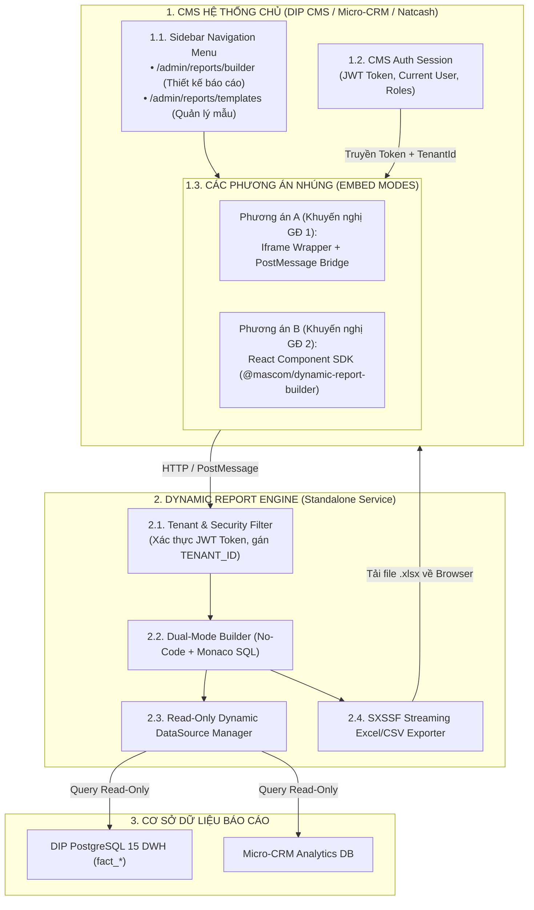

# HƯỚNG DẪN & PHƯƠNG ÁN TÍCH HỢP MICRO-REPORT VÀO HỆ THỐNG CMS
## (CMS INTEGRATION ARCHITECTURE & STEP-BY-STEP GUIDE)

**Dự án:** Phân hệ Báo Cáo Động Đa Nền Tảng (Micro-Report Engine)  
**Tài liệu tham chiếu:** [`docs/architecture/DYNAMIC_REPORT_ENGINE.md`](file:///Users/micro/Source/chapisoft/micro-report/docs/architecture/DYNAMIC_REPORT_ENGINE.md)  
**Mục tiêu:** Tích hợp phân hệ Báo Cáo Động độc lập vào CMS của **DIP Platform** (`src/cms`), **Micro-CRM** và **Natcash CMS**.  
**Ngày lập:** 21/08/2026  

---

## 1. TỔNG QUAN VỀ KIẾN TRÚC TÍCH HỢP (INTEGRATION ARCHITECTURE)



---

## 2. PHÂN TÍCH SO SÁNH 2 PHƯƠNG ÁN TÍCH HỢP VÀO CMS

| Tiêu Chí So Sánh | Phương Án A: Iframe Embed Wrapper (Khuyên dùng GĐ 1) | Phương Án B: React Component SDK (Khuyên dùng GĐ 2) |
|---|---|---|
| **Thời gian tích hợp** | ⚡ **Siêu nhanh (chỉ mất 1 - 2 giờ)** | ⏱️ Cần cài đặt packages và build bundle (~1 - 2 ngày) |
| **Độ độc lập & Nâng cấp** | 🟢 **Tuyệt đối:** Khi Report Engine nâng cấp thêm chart, fix bug, CMS **tự động có ngay** mà không cần build hay deploy lại CMS. | Cần cập nhật version của npm package và build lại CMS. |
| **Ảnh hưởng Bundle CMS** | 🟢 **0MB:** Không làm tăng kích thước file JS của CMS (không cần kéo Monaco Editor hay dnd-kit vào CMS). | Tăng kích thước JS bundle của CMS thêm ~400KB (gzip). |
| **Trải nghiệm UX/UI** | Tốt (hỗ trợ fullscreen, đồng bộ Theme Light/Dark qua postMessage). | Rất mượt mà, hòa nhập 100% vào DOM và Router của CMS. |
| **Khả năng áp dụng** | Áp dụng được cho **MỌI công nghệ CMS** (Next.js, React, Vue, Angular, PHP, HTML). | Chỉ áp dụng cho hệ thống dùng React / Next.js. |

> **👉 KẾT LUẬN CHIẾN LƯỢC:** 
> * **Giai đoạn 1 (Ngay lập tức):** Triển khai **Phương án A (Iframe Embed)** để đưa tính năng Báo Cáo Động lên CMS DIP và Micro-CRM trong thời gian ngắn nhất, kiểm thử toàn diện luồng người dùng.
> * **Giai đoạn 2:** Đóng gói thư viện NPM `@mascom/dynamic-report-builder` cho các dự án muốn nhúng Native Component sâu hơn.

---

## 3. HƯỚNG DẪN TÍCH HỢP CHI TIẾT VÀO CMS DIP (`src/cms`)

### Bước 1: Cấu Hình Biến Môi Trường (Environment Variable)
Thêm URL trỏ đến dịch vụ Report Engine trong `.env.local` hoặc `.env.production` của `src/cms`:
```env
NEXT_PUBLIC_REPORT_ENGINE_URL=https://reports.mascom.vn
```

---

### Bước 2: Tạo Component Reusable Iframe Bridge Wrapper
Tạo file [`src/shared/components/report/ReportEngineFrame.tsx`](file:///Users/micro/Source/mascom/DIP/src/cms/src/shared/components/report/ReportEngineFrame.tsx):

```tsx
'use client';

import React, { useEffect, useRef, useState } from 'react';
import Cookies from 'js-cookie';

interface ReportEngineFrameProps {
  viewMode?: 'builder' | 'templates';
  templateCode?: string;
  theme?: 'light' | 'dark';
  height?: string;
}

export const ReportEngineFrame: React.FC<ReportEngineFrameProps> = ({
  viewMode = 'builder',
  templateCode,
  theme = 'light',
  height = 'calc(100vh - 120px)'
}) => {
  const iframeRef = useRef<HTMLIFrameElement>(null);
  const [loading, setLoading] = useState(true);

  const engineBaseUrl = process.env.NEXT_PUBLIC_REPORT_ENGINE_URL || 'http://localhost:8088';
  const token = Cookies.get('token') || '';
  const tenantId = 'DIP_BHXH'; // Mã định danh hệ thống DIP

  const targetUrl = `${engineBaseUrl}/embed/reports/${viewMode}?tenant=${tenantId}&theme=${theme}${
    templateCode ? `&template=${templateCode}` : ''
  }`;

  useEffect(() => {
    // Lắng nghe sự kiện từ Report Engine gửi về CMS
    const handleMessage = (event: MessageEvent) => {
      if (event.origin !== new URL(engineBaseUrl).origin) return;

      const { type, payload } = event.data;
      if (type === 'REPORT_EXPORTED') {
        console.log('✅ Xuất file báo cáo thành công:', payload);
      } else if (type === 'TEMPLATE_SAVED') {
        console.log('💾 Đã lưu mẫu báo cáo:', payload);
      }
    };

    window.addEventListener('message', handleMessage);
    return () => window.removeEventListener('message', handleMessage);
  }, [engineBaseUrl]);

  return (
    <div style={{ width: '100%', height, position: 'relative' }}>
      {loading && (
        <div style={{
          position: 'absolute', top: 0, left: 0, right: 0, bottom: 0,
          display: 'flex', alignItems: 'center', justifyContent: 'center',
          background: 'rgba(255, 255, 255, 0.7)', zIndex: 10
        }}>
          <span>Đang nạp trình thiết kế báo cáo...</span>
        </div>
      )}
      <iframe
        ref={iframeRef}
        src={targetUrl}
        onLoad={() => {
          setLoading(false);
          // Gửi Token bảo mật cho Iframe qua PostMessage
          iframeRef.current?.contentWindow?.postMessage(
            { type: 'AUTH_HANDSHAKE', token, tenantId },
            engineBaseUrl
          );
        }}
        style={{
          width: '100%',
          height: '100%',
          border: 'none',
          borderRadius: '8px'
        }}
        allow="clipboard-write"
      />
    </div>
  );
};
```

---

### Bước 3: Tạo 2 Màn Hình Mới Trên CMS DIP

#### 1. Màn hình Thiết Kế Báo Cáo: `src/app/admin/reports/builder/page.tsx`
```tsx
import { ReportEngineFrame } from '@/shared/components/report/ReportEngineFrame';

export const metadata = {
  title: 'Thiết Kế Báo Cáo Động | DIP CMS'
};

export default function DynamicReportBuilderPage() {
  return (
    <div style={{ padding: '16px' }}>
      <ReportEngineFrame viewMode="builder" theme="light" />
    </div>
  );
}
```

#### 2. Màn hình Quản Lý Danh Mục Mẫu: `src/app/admin/reports/templates/page.tsx`
```tsx
import { ReportEngineFrame } from '@/shared/components/report/ReportEngineFrame';

export const metadata = {
  title: 'Danh Mục Mẫu Báo Cáo | DIP CMS'
};

export default function ReportTemplatesPage() {
  return (
    <div style={{ padding: '16px' }}>
      <ReportEngineFrame viewMode="templates" theme="light" />
    </div>
  );
}
```

---

### Bước 4: Cập Nhật Sidebar Menu CMS (`src/shared/components/layout/Sidebar/Sidebar.tsx`)
Bổ sung 2 mục vào nhóm `taiChinhBaoCao`:

```tsx
import { Wand2, FileSpreadsheet } from 'lucide-react';

// Trong menuGroups -> groupLabel: 'taiChinhBaoCao'
{
  groupLabel: 'taiChinhBaoCao',
  items: [
    { key: 'finance', path: '/admin/finance/transactions', match: '/admin/finance', icon: CreditCard },
    { key: 'thietKeBaoCaoDong', path: '/admin/reports/builder', match: '/admin/reports/builder', icon: Wand2 },
    { key: 'quanLyMauBaoCao', path: '/admin/reports/templates', match: '/admin/reports/templates', icon: FileSpreadsheet },
    { key: 'baoCaoDoiSoat', path: '/admin/reports/reconciliation', match: '/admin/reports/reconciliation', icon: PieChart },
    { key: 'bcHoaHongCtv', path: '/admin/reports/commission', match: '/admin/reports/commission', icon: BadgePercent },
    { key: 'bcThanhToanQr', path: '/admin/reports/qr', match: '/admin/reports/qr', icon: QrCode },
    { key: 'bcPhiVanChuyen', path: '/admin/reports/shipping', match: '/admin/reports/shipping', icon: Truck }
  ]
}
```

---

## 4. HƯỚNG DẪN TÍCH HỢP VÀO CÁC HỆ THỐNG KHÁC (MICRO-CRM, NATCASH)

Tương tự như DIP CMS, bất kỳ hệ thống nào chỉ cần:
1. Nhúng Iframe trỏ đến `https://reports.mascom.vn/embed/reports/builder?tenant=MICRO_CRM&theme=dark`.
2. Truyền `token` và `tenantId = "MICRO_CRM"` qua `postMessage`.
3. Report Engine sẽ tự động nạp danh mục CSDL của Micro-CRM, cô lập toàn bộ mẫu báo cáo và cho phép người dùng tại Micro-CRM sử dụng ngay lập tức mà **không cần viết lại 1 dòng code xử lý báo cáo nào**!
