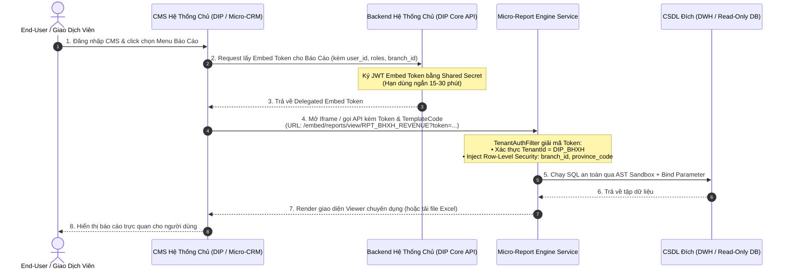
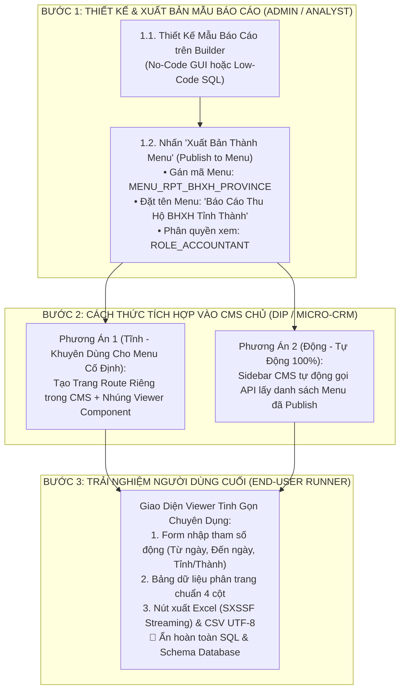

# GIẢI PHÁP XÁC THỰC ĐA NỀN TẢNG & XUẤT BÁO CÁO THÀNH MENU RIÊNG
## (PARTNER AUTHENTICATION & DEDICATED MENU INTEGRATION ARCHITECTURE)

**Dự án:** Standalone Hybrid Dynamic Report Engine  
**Hệ thống tích hợp:** DIP Platform (`src/cms`), Micro-CRM, Natcash CMS  
**Tài liệu:** `DOCS-202608-MASCOM-MR-INTEGRATION-V2`  
**Phiên bản:** 2.0 (Bổ sung xác thực Delegated Token, Row-Level Security & Dedicated Menu Publishing)  
**Ngày cập nhật:** 21/08/2026  

---

## 1. BÀI TOÁN & YÊU CẦU NGHIỆP VỤ (BUSINESS REQUIREMENTS)

Trong quá trình vận hành thực tế tại MASCOM/Chapisoft, phân hệ Báo Cáo Động (`micro-report`) cần đáp ứng 2 bài toán tích hợp trọng tâm:

1. **Xác thực Đa Người Thuê & Phân Quyền Dữ Liệu (Multi-Tenant Authentication & RLS):**
   * Các nền tảng chủ như **DIP Platform** (Thu hộ BHXH), **Micro-CRM** và **Natcash** đều có hệ thống người dùng, phân quyền và Tenant riêng.
   * Cần cơ chế xác thực an toàn để khi người dùng đăng nhập vào CMS DIP, hệ thống tự động nhận diện danh tính (`user_id`), phạm vi dữ liệu (`branch_id`, `province_code`) và quyền hạn mà không bắt người dùng phải đăng nhập lại (SSO/Token Delegation).
2. **Xuất Bản Báo Cáo Riêng Thành Menu Độc Lập (Publish as Dedicated Menu Item):**
   * Sau khi Admin hoặc Data Analyst thiết kế và kiểm thử thành công một mẫu báo cáo hữu ích (ví dụ: *Báo Cáo Doanh Thu Thu Hộ BHXH Theo Tỉnh Thành*, *Báo Cáo Biến Động Số Dư Đại Lý*), Admin muốn **"xuất bản" (Publish)** báo cáo này thành một mục menu chính thức trên thanh điều hướng Sidebar của CMS DIP hoặc Micro-CRM.
   * Người dùng cuối (giao dịch viên, kế toán) khi bấm vào Menu này sẽ **chỉ thấy giao diện Chạy Báo Cáo Chuyên Dụng (Dedicated Report Viewer)**: Form nhập tham số lọc, Bảng dữ liệu preview, Nút xuất Excel/CSV — *Tuyệt đối không thấy trình soạn thảo SQL hay công cụ can thiệp schema*.

---

## 2. PHƯƠNG ÁN XÁC THỰC ĐỐI TÁC & PHÂN QUYỀN DỮ LIỆU (AUTHENTICATION ARCHITECTURE)



### 2.1. Cấu Trúc Payload Của Delegated Embed Token
Backend của hệ thống chủ (DIP/CRM) phát hành token JWT với cấu trúc tiêu chuẩn:

```json
{
  "iss": "dip-platform.mascom.vn",
  "sub": "user_10283",
  "tenant_id": "DIP_BHXH",
  "username": "nguyen.van.a",
  "roles": ["DIP_OPERATOR", "DIP_ACCOUNTANT"],
  "allowed_templates": ["RPT_BHXH_REVENUE_2026", "RPT_DAILY_TRANSACTIONS"],
  "data_scope": {
    "province_code": "HAN",
    "branch_id": "BRANCH_001"
  },
  "exp": 1755772800,
  "iat": 1755771000
}
```

### 2.2. Cơ Chế Bảo Vệ Dữ Liệu Tầng Dòng (Row-Level Security - RLS)
Report Engine tự động map các biến trong `data_scope` vào câu lệnh truy vấn SQL:
* Người dùng không thể sửa đổi hoặc bỏ qua các biến này trên giao diện.
* SQL tự động gán Named Parameters: `WHERE PROVINCE_CODE = :scope_province_code AND BRANCH_ID = :scope_branch_id`.

### 2.3. Cơ Chế Giới Hạn CSDL Theo Người Dùng / Phiên (`listDatasource` Filter)
Hệ thống hỗ trợ cơ chế phân quyền kết nối CSDL (DataSource) linh hoạt 2 tầng:

1. **Cô Lập Đa Người Thuê Tuyệt Đối (Multi-Tenancy Isolation):**
   * Người dùng thuộc Tenant nào (ví dụ: `DIP_BHXH`) **chỉ nhìn thấy và truy vấn các DataSource của Tenant đó**. Tuyệt đối không thể thấy hoặc kết nối tới DataSource của Tenant khác (ví dụ: `MICRO_CRM`).
2. **Bộ Lọc Phân Quyền Theo Phiên (`listDatasource`):**
   * **Không truyền tham số hoặc truyền `all`:** Hiển thị tất cả DataSource hợp lệ của Tenant hiện tại.
   * **Có truyền danh sách (ví dụ: `listDatasource=DIP_DWH,DIP_CORE`):** Hệ thống chỉ hiển thị và cho phép chọn các DataSource hợp lệ nằm trong danh sách.
   * **Truyền DataSource ngoại lai:** Nếu một DataSource không thuộc quyền sở hữu của Tenant, hệ thống sẽ tự động loại bỏ để đảm bảo an toàn 100%.

#### Cách sử dụng trên các kênh tích hợp:
* **Nhúng qua URL Embed:**
  ```
  https://rpf.microtec.vn/embed/reports/builder?tenant=DIP_BHXH&listDatasource=DIP_DWH,DIP_CORE
  ```
* **Nhúng qua React Component SDK:**
  ```tsx
  <DynamicReportBuilder
    engineUrl="https://rpe.microtec.vn"
    tenantId="DIP_BHXH"
    listDatasource={["DIP_DWH", "DIP_CORE"]}
    theme="light"
  />
  ```
* **Gọi qua REST API:**
  ```http
  GET https://rpe.microtec.vn/api/v1/reports/datasources?listDatasource=DIP_DWH,DIP_CORE
  X-Tenant-Id: DIP_BHXH
  ```

---

## 3. PHƯƠNG ÁN XUẤT BÁO CÁO THÀNH MENU RIÊNG CHO HỆ THỐNG TÍCH HỢP



---

## 4. CHI TIẾT 2 PHƯƠNG THỨC TÍCH HỢP MENU VÀO CMS DIP & MICRO-CRM

### 4.1. Phương Thức 1: Tạo Route Cố Định Trong CMS (Static Dedicated Route)
Phù hợp với các báo cáo nghiệp vụ trọng điểm cần hiển thị cố định trên Sidebar của CMS DIP.

#### 1. Tạo file trang Báo cáo riêng trong CMS DIP:
Đường dẫn: `src/cms/src/app/(dashboard)/reports/bhxh-province-revenue/page.tsx`

```tsx
'use client';

import React from 'react';
import { ReportEngineFrame } from '@/shared/components/report/ReportEngineFrame';

export default function BhxhProvinceRevenuePage() {
  return (
    <div className="p-6 space-y-4">
      <div className="flex items-center justify-between">
        <div>
          <h1 className="text-lg font-bold text-slate-900 dark:text-slate-100">
            Báo Cáo Doanh Thu Thu Hộ BHXH Theo Tỉnh Thành
          </h1>
          <p className="text-xs text-slate-500">
            Dữ liệu tổng hợp từ kho DWH, cập nhật định kỳ mỗi 15 phút.
          </p>
        </div>
      </div>

      {/* Nhúng Viewer chế độ Runner độc lập */}
      <ReportEngineFrame
        viewMode="viewer"
        templateCode="RPT_BHXH_PROVINCE_REVENUE"
        height="calc(100vh - 160px)"
      />
    </div>
  );
}
```

#### 2. Khai báo Menu trong Sidebar Configuration của CMS:
Đường dẫn: `src/cms/src/config/menu.config.ts`

```typescript
export const SIDEBAR_MENU_ITEMS = [
  {
    key: 'bhxh-reports-group',
    label: 'Báo Cáo Nghiệp Vụ BHXH',
    icon: 'FileSpreadsheet',
    roles: ['ADMIN', 'BHXH_ACCOUNTANT', 'SUPERVISOR'],
    children: [
      {
        key: 'rpt-bhxh-province',
        label: 'Doanh Thu Theo Tỉnh Thành',
        path: '/reports/bhxh-province-revenue',
        icon: 'TrendingUp',
      },
      {
        key: 'rpt-bhxh-daily',
        label: 'Giao Dịch Thu Hộ Hàng Ngày',
        path: '/reports/bhxh-daily-transactions',
        icon: 'Calendar',
      }
    ]
  }
];
```

---

### 4.2. Phương Thức 2: Đồng Bộ Menu Động Tự Động (Dynamic Menu Sync)
Phù hợp khi Admin thường xuyên tạo và xuất bản thêm nhiều báo cáo mới mà không muốn phải code thêm trang mới hay deploy lại CMS.

1. **CMS DIP có 1 Dynamic Route chung:**
   Đường dẫn: `src/cms/src/app/(dashboard)/reports/custom/[code]/page.tsx`

```tsx
'use client';

import React from 'react';
import { useParams } from 'next/navigation';
import { ReportEngineFrame } from '@/shared/components/report/ReportEngineFrame';

export default function DynamicCustomReportPage() {
  const params = useParams();
  const templateCode = String(params.code);

  return (
    <div className="p-6">
      <ReportEngineFrame
        viewMode="viewer"
        templateCode={templateCode}
        height="calc(100vh - 120px)"
      />
    </div>
  );
}
```

2. **Sidebar của CMS DIP tự động gọi API lấy danh sách Menu đã Publish:**
   * **API Endpoint:** `GET /api/v1/reports/templates/published`
   * **Response:**
   ```json
   [
     {
       "templateCode": "RPT_BHXH_PROVINCE_REVENUE",
       "templateName": "Báo Cáo Thu Hộ BHXH Tỉnh Thành",
       "menuGroup": "Báo Cáo BHXH",
       "icon": "BarChart3",
       "path": "/reports/custom/RPT_BHXH_PROVINCE_REVENUE",
       "allowedRoles": ["BHXH_ACCOUNTANT", "ADMIN"]
     }
   ]
   ```

---

## 5. ĐẶC TẢ GIAO DIỆN VIEWER CHUYÊN DỤNG (STANDALONE REPORT VIEWER)

Trang nhúng Standalone Viewer URL: `https://rpf.microtec.vn/embed/reports/viewer/{templateCode}?token=...`

```
+----------------------------------------------------------------------------------------------------+
| 📊 BÁO CÁO DOANH THU THU HỘ BHXH THEO TỈNH THÀNH                                     v4.0 Live DWH |
| Mô tả: Báo cáo tổng hợp số lượt giao dịch và doanh thu theo 63 tỉnh/thành phố                      |
+----------------------------------------------------------------------------------------------------+
| 🔍 BỘ LỌC THAM SỐ ĐẦU VÀO (DYNAMIC PARAMETERS):                                                    |
| [Từ Ngày: 2026-08-01 📅]  [Đến Ngày: 2026-08-21 📅]  [Tỉnh/Thành: Hà Nội ▼]                        |
|                                                     [ ▶ Chạy Báo Cáo ]  [ 📥 Xuất Excel ] [ 📄 CSV ]|
+----------------------------------------------------------------------------------------------------+
| KẾT QUẢ TRUY VẤN (Thời gian chạy: 42ms • Tổng số dòng: 1,420 dòng)                                 |
| [X] | STT | Thao Tác | Mã Tỉnh | Tên Tỉnh Thành | Số Lượt Thu Hộ | Doanh Thu (VNĐ)   | Trạng Thái  |
| [ ] |  1  |   [👁]   | HN      | Hà Nội         |         14,280 | 128,450,000,000 ₫ | ĐÃ ĐỐI SOÁT |
| [ ] |  2  |   [👁]   | HCM     | TP. Hồ Chí Minh|         18,920 | 194,120,000,000 ₫ | ĐÃ ĐỐI SOÁT |
| [ ] |  3  |   [👁]   | DNG     | Đà Nẵng        |          4,310 |  38,700,000,000 ₫ | ĐÃ ĐỐI SOÁT |
| Trang: < [ 1 ] 2 3 > • Hiển thị 50 dòng/trang                                                      |
+----------------------------------------------------------------------------------------------------+
```

---

## 6. MA TRẬN PHÂN QUYỀN TRÊN NỀN TẢNG TÍCH HỢP

| Đối Tượng Người Dùng | Quyền Hạn Trên Report Engine | Giao Diện Được Phép Truy Cập |
|---|---|---|
| **System Admin / Tech Lead** | Quản lý toàn diện DataSource, cấu hình DWH Sync, phân quyền Tenant | `/admin/configs/dwh-sync`, `/reports/templates`, `/reports/builder` |
| **Data Analyst / Designer** | Tạo mới, thử nghiệm SQL, thiết kế GUI, Xuất bản (Publish to Menu) | `/reports/builder`, `/reports/templates` |
| **Giao Dịch Viên / Kế Toán (End-User)** | **Chỉ chạy báo cáo, chọn tham số lọc và xuất file Excel/CSV** | **Dedicated Menu Route** (`/reports/custom/[code]`), **Tuyệt đối không thấy Builder/SQL** |
