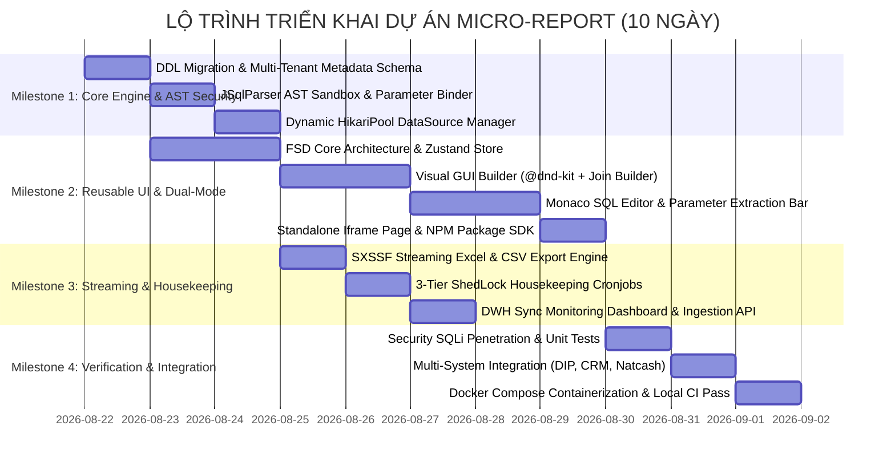

# KẾ HOẠCH TRIỂN KHAI CHI TIẾT DỰ ÁN MICRO-REPORT (DETAIL WBS PROJECT PLAN)
## STANDALONE HYBRID DYNAMIC REPORT ENGINE — MASCOM / CHAPISOFT

**Mã tài liệu:** `PLAN-202608-MASCOM-MR-DETAIL`  
**Phiên bản:** 2.0 (Phân rã công việc WBS chi tiết, Milestones & Definition of Done)  
**Ngày phát hành:** 21/08/2026  
**Chủ nhiệm dự án:** Core Architecture Team MASCOM  
**Tài liệu tham chiếu:**
* [`docs/architecture/DYNAMIC_REPORT_ENGINE.md`](file:///Users/micro/Source/chapisoft/micro-report/docs/architecture/DYNAMIC_REPORT_ENGINE.md) (Master Architecture v4.0)
* [`plan/DYNAMIC_REPORT_MASTER_PLAN.md`](file:///Users/micro/Source/chapisoft/micro-report/plan/DYNAMIC_REPORT_MASTER_PLAN.md) (Master 10-Day Plan)
* [`docs/PROJECT_STATUS.md`](file:///Users/micro/Source/chapisoft/micro-report/docs/PROJECT_STATUS.md) (Real-Time Status Dashboard)

---

## 1. MỤC TIÊU DỰ ÁN & TIÊU CHÍ NGHIỆM THU (PROJECT OBJECTIVES & ACCEPTANCE CRITERIA)

### 1.1. Mục Tiêu Cốt Lõi
1. **Dịch Vụ Cắm Ghép Độc Lập (Pluggable Microservice):** Đóng gói trọn vẹn Backend Spring Boot 3 + Frontend Next.js 14 thành cụm Docker độc lập, không hardcode nghiệp vụ của bất kỳ dự án đơn lẻ nào.
2. **Đa Người Thuê Tuyệt Đối (Multi-Tenancy):** Phục vụ đồng thời nhiều hệ sinh thái nội bộ và đối tác (`DIP_BHXH`, `NATCASH_PAYMENT`, `MICRO_CRM`, `MASCOM_ERP`) với không gian cấu hình và quyền dữ liệu cô lập 100%.
3. **Mô Hình Lai Đột Phá (Dual-Mode Builder):**
   * *No-Code Visual GUI Builder:* Kéo thả trường dữ liệu, Visual Join Builder, bộ lọc điều kiện `AND`/`OR`, nút 1-click `Convert GUI to SQL`.
   * *Low-Code Monaco Editor:* Trình soạn thảo SQL chuẩn VS Code, hỗ trợ CTE, Window Functions, dynamic parameters `{{params.var}}` và biến đổi JavaScript hậu kỳ.
4. **Bảo Mật Cấp Doanh Nghiệp (JSqlParser AST Sandbox):** 100% câu lệnh SQL phải được phân tích qua AST Sandbox để chặn triệt để toàn bộ lệnh DML/DDL (`INSERT`, `UPDATE`, `DELETE`, `DROP`, `ALTER`, `TRUNCATE`, `SELECT INTO`).
5. **Hiệu Năng Streaming Dữ Liệu Lớn (SXSSF Streaming):** Xuất file Excel (`.xlsx`) và CSV tới 100.000 dòng với RAM footprint $< 50\text{MB}$ qua cơ chế Apache POI `SXSSFWorkbook(500)`.
6. **3 Phương Thức Tích Hợp Sẵn Sàng:** Reusable NPM React Component (`@mascom/dynamic-report-builder`), Standalone Iframe Embed URL kèm `postMessage` Event Bridge, và Headless RESTful APIs.

---

## 2. LỘ TRÌNH MILESTONES & PHÂN RÃ CÔNG VIỆC CHI TIẾT (WBS)

---

### 🔹 GIAI ĐOẠN 1: BACKEND CORE, MULTI-TENANCY & AST SECURITY (NGÀY 1 – NGÀY 3)

| Mã Task | Tên Công Việc Chi Tiết | File Triển Khai Chính | Tiêu Chí Hoàn Thành (DoD) | Người Phụ Trách |
|---|---|---|---|---|
| **WBS 1.1** | Khởi tạo cấu trúc dự án Spring Boot 3.3 Java 21 LTS theo Hexagonal Architecture | [`src/backend/build.gradle`](file:///Users/micro/Source/chapisoft/micro-report/src/backend/build.gradle) | Gradle wrapper hoạt động, tải đủ thư viện HikariCP, JSqlParser, POI, Flyway, ShedLock. | Backend Lead |
| **WBS 1.2** | Thiết kế Flyway Migration DDL khởi tạo schema metadata nội bộ (`RPT_TENANTS`, `RPT_DATASOURCES`, `RPT_TEMPLATES`, `RPT_EXPORT_TASKS`, `shedlock`) | [`V1__init_report_engine_metadata.sql`](file:///Users/micro/Source/chapisoft/micro-report/src/backend/src/main/resources/db/migration/V1__init_report_engine_metadata.sql) | Script chạy thành công trên PostgreSQL 15 & H2 in-memory test. | Backend Dev |
| **WBS 1.3** | Xây dựng bộ phân tích an toàn `SqlSecurityAstValidator` sử dụng `JSqlParser` | [`SqlSecurityAstValidator.java`](file:///Users/micro/Source/chapisoft/micro-report/src/backend/src/main/java/io/chapisoft/report/domain/security/SqlSecurityAstValidator.java) | Chặn 100% các câu lệnh DML/DDL (`INSERT`, `UPDATE`, `DELETE`, `DROP`, `ALTER`, `TRUNCATE`, `SELECT INTO`). | Security Lead |
| **WBS 1.4** | Xây dựng bộ liên kết tham số động `DynamicParameterBinder` | [`DynamicParameterBinder.java`](file:///Users/micro/Source/chapisoft/micro-report/src/backend/src/main/java/io/chapisoft/report/domain/security/DynamicParameterBinder.java) | Regex `{{params.var}}` tự động chuyển đổi thành Named Parameter `:param_var` an toàn. | Backend Dev |
| **WBS 1.5** | Xây dựng dịch vụ mã hóa AES-256 bảo mật mật khẩu kết nối CSDL | [`AesEncryptionService.java`](file:///Users/micro/Source/chapisoft/micro-report/src/backend/src/main/java/io/chapisoft/report/domain/security/AesEncryptionService.java) | Mã hóa mật khẩu CSDL trước khi lưu vào `RPT_DATASOURCES` và giải mã khi mở pool. | Security Lead |
| **WBS 1.6** | Xây dựng bộ quản lý kết nối CSDL động `DynamicDataSourceManager` | [`DynamicDataSourceManager.java`](file:///Users/micro/Source/chapisoft/micro-report/src/backend/src/main/java/io/chapisoft/report/application/service/DynamicDataSourceManager.java) | Quản lý cache HikariPool đa CSDL (PostgreSQL, Oracle, MySQL, SQL Server) kèm cờ `isReadOnly = true`. | Backend Dev |
| **WBS 1.7** | Xây dựng dịch vụ quét cây danh mục CSDL `SchemaExplorerService` | [`SchemaExplorerService.java`](file:///Users/micro/Source/chapisoft/micro-report/src/backend/src/main/java/io/chapisoft/report/application/service/SchemaExplorerService.java) | Quét tự động danh sách Bảng, View, Cột, Kiểu dữ liệu, Khóa chính qua JDBC DatabaseMetaData. | Backend Dev |
| **WBS 1.8** | Xây dựng bộ lọc xác thực đa người thuê `TenantAuthFilter` | [`TenantAuthFilter.java`](file:///Users/micro/Source/chapisoft/micro-report/src/backend/src/main/java/io/chapisoft/report/adapter/in/web/filter/TenantAuthFilter.java) | Trích xuất thông tin Tenant từ JWT Claims hoặc cặp Header `X-Tenant-Id` + `X-API-Key`. | Security Dev |

---

### 🔹 GIAI ĐOẠN 2: FRONTEND UI DUAL-MODE BUILDER & REUSABLE SDK (NGÀY 4 – NGÀY 6)

| Mã Task | Tên Công Việc Chi Tiết | File Triển Khai Chính | Tiêu Chí Hoàn Thành (DoD) | Người Phụ Trách |
|---|---|---|---|---|
| **WBS 2.1** | Khởi tạo cấu trúc Frontend Next.js 14 App Router, Tailwind CSS và Zustand Store | [`useReportBuilderStore.ts`](file:///Users/micro/Source/chapisoft/micro-report/src/frontend/src/features/dynamic-builder/model/useReportBuilderStore.ts) | Quản lý state tập trung cho Dual-Mode (`GUI` / `SQL`), dynamic params, active template. | Frontend Lead |
| **WBS 2.2** | Xây dựng Component thanh bên trái `SchemaTreeExplorer` | [`SchemaTreeExplorer.tsx`](file:///Users/micro/Source/chapisoft/micro-report/src/frontend/src/features/dynamic-builder/ui/SchemaTreeExplorer.tsx) | Hiển thị cây thư mục CSDL, tìm kiếm bảng/cột, đánh dấu Khóa chính, chọn bảng gốc. | Frontend Dev |
| **WBS 2.3** | Xây dựng Chế độ No-Code `VisualGuiBuilder` | [`VisualGuiBuilder.tsx`](file:///Users/micro/Source/chapisoft/micro-report/src/frontend/src/features/dynamic-builder/ui/VisualGuiBuilder.tsx) | Kéo thả chọn cột, đặt bí danh, gán hàm tổng hợp (`SUM`, `COUNT`), Visual Join, Filter `AND`/`OR`, nút `Convert GUI to SQL`. | Frontend Dev |
| **WBS 2.4** | Xây dựng Chế độ Low-Code `MonacoSqlEditor` | [`MonacoSqlEditor.tsx`](file:///Users/micro/Source/chapisoft/micro-report/src/frontend/src/features/dynamic-builder/ui/MonacoSqlEditor.tsx) | Tích hợp Monaco Editor chuẩn VS Code, tự động quét tham số `{{params.var}}` ra form input, tab JavaScript Transformations. | Frontend Dev |
| **WBS 2.5** | Xây dựng bảng xem trước thời gian thực `LiveDataPreviewTable` | [`LiveDataPreviewTable.tsx`](file:///Users/micro/Source/chapisoft/micro-report/src/frontend/src/features/dynamic-builder/ui/LiveDataPreviewTable.tsx) | Tuân thủ thứ tự cột: `Checkbox` $\rightarrow$ `STT` $\rightarrow$ `Thao tác` $\rightarrow$ `Dữ liệu`, hiển thị thời gian chạy query. | Frontend Dev |
| **WBS 2.6** | Xây dựng modal xuất dữ liệu `ExportModal` | [`ExportModal.tsx`](file:///Users/micro/Source/chapisoft/micro-report/src/frontend/src/features/dynamic-builder/ui/ExportModal.tsx) | Chọn định dạng Excel (.xlsx) hoặc CSV UTF-8 (.csv), hiển thị tiến độ và link tải trực tiếp. | Frontend Dev |
| **WBS 2.7** | Đóng gói Reusable NPM Component Package `@mascom/dynamic-report-builder` | [`src/sdk/package.json`](file:///Users/micro/Source/chapisoft/micro-report/src/sdk/package.json) | Export component sẵn sàng nhúng vào bất kỳ ứng dụng React/Next.js bên ngoài. | Frontend Lead |
| **WBS 2.8** | Xây dựng trang nhúng Iframe Standalone `/embed/reports/builder` | [`page.tsx`](file:///Users/micro/Source/chapisoft/micro-report/src/frontend/src/app/(embed)/embed/reports/builder/page.tsx) | Hỗ trợ nhúng Iframe cho Vue, Angular, Legacy Web kèm `window.postMessage` Event Bridge. | Frontend Dev |

---

### 🔹 GIAI ĐOẠN 3: STREAMING EXPORT, HOUSEKEEPING & SYNC DASHBOARD (NGÀY 7 – NGÀY 8)

| Mã Task | Tên Công Việc Chi Tiết | File Triển Khai Chính | Tiêu Chí Hoàn Thành (DoD) | Người Phụ Trách |
|---|---|---|---|---|
| **WBS 3.1** | Xây dựng động cơ xuất file Streaming `SxssfStreamingExportService` | [`SxssfStreamingExportService.java`](file:///Users/micro/Source/chapisoft/micro-report/src/backend/src/main/java/io/chapisoft/report/application/service/SxssfStreamingExportService.java) | Xuất file Excel/CSV tới 100.000 dòng, giữ RAM footprint $< 50\text{MB}$ nhờ Apache POI SXSSF Window 500 dòng. | Backend Lead |
| **WBS 3.2** | Xây dựng 2 Cronjobs quản lý vòng đời 3 tầng `HousekeepingScheduler` với ShedLock | [`HousekeepingScheduler.java`](file:///Users/micro/Source/chapisoft/micro-report/src/backend/src/main/java/io/chapisoft/report/adapter/in/scheduler/HousekeepingScheduler.java) | Tự động dọn file tạm hết hạn sau 24h lúc 01:00 AM và đóng băng mẫu cũ không dùng quá 90 ngày lúc 02:00 AM. | Backend Dev |
| **WBS 3.3** | Xây dựng dịch vụ lập lịch đồng bộ kho dữ liệu `DwhSyncScheduler` | [`DwhSyncScheduler.java`](file:///Users/micro/Source/chapisoft/micro-report/src/backend/src/main/java/io/chapisoft/report/adapter/in/scheduler/DwhSyncScheduler.java) | Lập lịch Batch Sync bù mỗi 60 phút, Nightly Reconcile lúc 00:30 AM và Refresh Materialized Views mỗi 15 phút. | Backend Dev |
| **WBS 3.4** | Xây dựng màn hình Dashboard giám sát và kích hoạt đồng bộ bù thủ công | [`page.tsx`](file:///Users/micro/Source/chapisoft/micro-report/src/frontend/src/app/(admin)/configs/dwh-sync/page.tsx) | Giao diện theo dõi các kênh sync và nút bấm kích hoạt đồng bộ bù theo khoảng ngày. | Frontend Dev |

---

### 🔹 GIAI ĐOẠN 4: CONTAINERIZATION, KIỂM THỬ AN TOÀN & LOCAL CI (NGÀY 9 – NGÀY 10)

| Mã Task | Tên Công Việc Chi Tiết | File Triển Khai Chính | Tiêu Chí Hoàn Thành (DoD) | Người Phụ Trách |
|---|---|---|---|---|
| **WBS 4.1** | Xây dựng bộ Unit Tests kiểm thử AST Security Sandbox & Dynamic Parameter Binding | [`SqlSecurityAstValidatorTest.java`](file:///Users/micro/Source/chapisoft/micro-report/src/backend/src/test/java/io/chapisoft/report/domain/security/SqlSecurityAstValidatorTest.java) | 20 test cases kiểm thử chặn DML/DDL, multi-statements, parameter binding và mã hóa AES pass 100%. | QA & Security |
| **WBS 4.2** | Xây dựng Dockerfiles Multi-stage & cấu hình `docker-compose.yml` | [`docker-compose.yml`](file:///Users/micro/Source/chapisoft/micro-report/deploy/docker-compose.yml) | Đóng gói Backend (Java 21 JRE), Frontend (Node 20 Standalone) và PostgreSQL Metadata DB. | DevOps Lead |
| **WBS 4.3** | Thiết lập và chạy kịch bản kiểm tra tự động Pre-Commit Local CI | [`scripts/local_ci.sh`](file:///Users/micro/Source/chapisoft/micro-report/scripts/local_ci.sh) | Toàn bộ Unit Tests Backend, TypeScript, ESLint Frontend và Mermaid diagrams đều đạt kết quả PASS 100%. | DevOps / QA |

---

### 🔹 GIAI ĐOẠN 5: CODE AUDIT, I18N TOAST SYSTEM & DEDICATED MENU INTEGRATION

| Mã Task | Tên Công Việc Chi Tiết | File Triển Khai Chính | Tiêu Chí Hoàn Thành (DoD) | Người Phụ Trách |
|---|---|---|---|---|
| **WBS 5.1** | Kiểm toán toàn bộ dự án loại bỏ hardcode/mock data, chuẩn hóa hệ thống Enums | [`TenantStatus.java`](file:///Users/micro/Source/chapisoft/micro-report/src/backend/src/main/java/io/chapisoft/report/domain/model/TenantStatus.java), [`types.ts`](file:///Users/micro/Source/chapisoft/micro-report/src/frontend/src/features/dynamic-builder/model/types.ts) | 100% không mock data, thay thế raw strings bằng Enums định kiểu chặt chẽ. | Tech Lead |
| **WBS 5.2** | Xây dựng hệ thống Đa ngôn ngữ (I18n) & Toast Notification | [`vi.ts`](file:///Users/micro/Source/chapisoft/micro-report/src/frontend/src/shared/locales/vi.ts), [`useToast.ts`](file:///Users/micro/Source/chapisoft/micro-report/src/frontend/src/shared/hooks/useToast.ts), [`ToastContainer.tsx`](file:///Users/micro/Source/chapisoft/micro-report/src/frontend/src/shared/ui/ToastContainer.tsx) | Loại bỏ 100% `alert()`, hỗ trợ đa ngôn ngữ `t(...)` toàn bộ components. | Frontend Dev |
| **WBS 5.3** | Xây dựng kiến trúc Xuất bản Báo cáo thành Menu riêng & Standalone Viewer cho DIP/CRM | [`CMS_REPORT_INTEGRATION_GUIDE.md`](file:///Users/micro/Source/chapisoft/micro-report/docs/integration/CMS_REPORT_INTEGRATION_GUIDE.md) | Tài liệu hóa giải pháp Delegated Token SSO, Row-Level Security và Dynamic Menu Sync API. | Solution Architect |

---

## 3. MA TRẬN TRÁCH NHIỆM RACI (RACI MATRIX)

* **R (Responsible):** Người trực tiếp thực hiện công việc.
* **A (Accountable):** Người chịu trách nhiệm phê duyệt và kết quả cuối cùng.
* **C (Consulted):** Người được tham vấn chuyên môn (DBA, Security, UI/UX).
* **I (Informed):** Người nhận thông báo về tiến độ và kết quả.

| Nhóm Công Việc | Backend Dev | Frontend Dev | Tech Lead | Security Lead | QA Lead | DevOps Lead |
|---|:---:|:---:|:---:|:---:|:---:|:---:|
| **1. Database Schema & Flyway Migration** | **R** | I | **A** | C | I | C |
| **2. JSqlParser AST Security & Parameter Binding** | **R** | I | C | **A** | C | I |
| **3. Dynamic HikariPool & Schema Explorer** | **R** | C | **A** | C | I | C |
| **4. Visual GUI Builder & Monaco SQL Editor** | I | **R** | C | I | C | I |
| **5. Reusable NPM SDK & Standalone Iframe Embed** | I | **R** | **A** | C | C | I |
| **6. SXSSF Streaming Export (Excel/CSV)** | **R** | C | **A** | I | C | C |
| **7. 3-Tier Lifecycle Housekeeping Cronjobs** | **R** | I | **A** | I | I | C |
| **8. DWH Sync Dashboard & Scheduler** | C | **R** | **A** | I | I | C |
| **9. Unit Tests, AST Pentest & Local CI Script** | **R** | **R** | **A** | C | **R** | C |
| **10. Docker Deployment & Containerization** | C | C | **A** | C | I | **R** |

---

## 4. QUẢN TRỊ RỦI RO & PHƯƠNG ÁN XỬ LÝ (RISK REGISTER & MITIGATION)

| STT | Rủi Ro Tiềm Ẩn | Mức Độ | Phương Án Giảm Thiểu & Khắc Phục |
|---|---|:---:|---|
| **1** | Người dùng cố tình chèn SQL Injection hoặc lệnh DDL phá hoại qua chế độ SQL | **Cao** | 100% câu lệnh phải đi qua `SqlSecurityAstValidator` (JSqlParser AST Sandbox) chặn DML/DDL và bind tham số qua `MapSqlParameterSource`. Bắt buộc kết nối CSDL ở chế độ `isReadOnly = true`. |
| **2** | Xuất báo cáo dữ liệu quá lớn gây Out-Of-Memory (OOM Crash) máy chủ | **Cao** | Áp dụng Apache POI `SXSSFWorkbook(500)` ghi theo dòng ra đĩa tạm, khống chế RAM footprint $< 50\text{MB}$ và giới hạn tối đa 100.000 dòng. |
| **3** | Rò rỉ thông tin dữ liệu giữa các Tenant (Tenant Leakage) | **Nghiêm trọng** | Ép cứng điều kiện `WHERE TENANT_ID = :tenantId` trên toàn bộ truy vấn metadata và xác thực token JWT / API Key qua `TenantAuthFilter`. |
| **4** | CSDL đích phản hồi quá chậm làm treo luồng HTTP | **Trung bình** | Cấu hình `statement_timeout = 30000;` (30 giây) và `connectionTimeout = 10000;` trên tất cả kết nối HikariPool động. |
| **5** | Tràn dung lượng ổ đĩa do lưu trữ file xuất tạm | **Thấp** | Cronjob ShedLock chạy lúc 01:00 AM hàng ngày tự động xóa toàn bộ file tạm quá 24h. |
