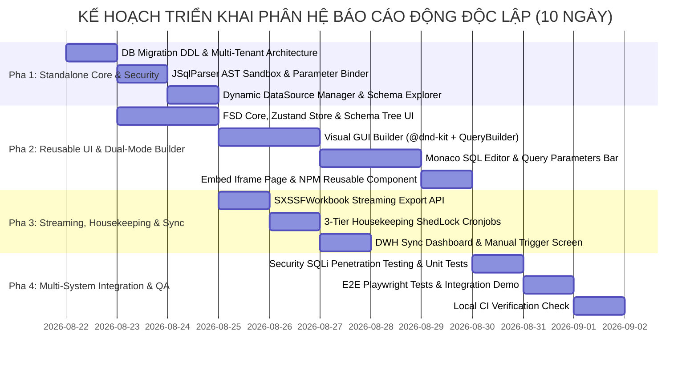

# KẾ HOẠCH TRIỂN KHAI CHI TIẾT: PHÂN HỆ BÁO CÁO ĐỘNG ĐỘC LẬP
## (STANDALONE HYBRID DYNAMIC REPORT ENGINE IMPLEMENTATION PLAN)

**Dự án:** Phân hệ Báo Cáo Động Đa Nền Tảng (Standalone Dynamic Report Engine)  
**Tài liệu tham chiếu:** [`docs/architecture/DYNAMIC_REPORT_ENGINE.md`](file:///Users/micro/Source/chapisoft/micro-report/docs/architecture/DYNAMIC_REPORT_ENGINE.md) (Master Technical Design v4.0)  
**Mã tài liệu:** `PLAN-202608-MASCOM-DYN-RPT`  
**Ngày lập:** 21/08/2026  
**Thời lượng dự kiến:** 10 Ngày làm việc (2 Sprints)  
**Đơn vị thực hiện:** Core Team MASCOM / Chapisoft (Backend, Frontend CMS, QA, DevOps)  

---

## 1. TỔNG QUAN & MỤC TIÊU DỊCH VỤ ĐỘC LẬP (STANDALONE ENGINE)

### 1.1. Mục Tiêu Dự Án
Xây dựng phân hệ **Báo Cáo Động Lai (Hybrid Dynamic Report Engine)** hoạt động như một **Dịch vụ Độc lập (Standalone Microservice / Pluggable SaaS Module)**, cho phép:
1. **Hoạt Động Độc Lập Hoàn Toàn:** Không ràng buộc hay phụ thuộc vào nghiệp vụ của một dự án đơn lẻ. Sẵn sàng đóng gói Docker, triển khai độc lập và kết nối với bất kỳ CSDL nào (PostgreSQL, Oracle, MySQL, SQL Server, ClickHouse).
2. **Đa Người Thuê (Multi-Tenancy):** Phục vụ đồng thời nhiều hệ thống (`TENANT_ID`: `DIP_BHXH`, `NATCASH_PAYMENT`, `MASCOM_ERP`, `ECOMMERCE_APP`) với không gian cấu hình, phân quyền và dữ liệu hoàn toàn cô lập.
3. **Mô Hình Lai Đột Phá (No-Code + Low-Code):**
   * *No-Code:* Schema Explorer động, Visual Join Builder, Drag & Drop cột và bộ lọc điều kiện trực quan.
   * *Low-Code:* Monaco SQL Editor (chuẩn VS Code), CTE, Window Functions, Dynamic Parameters `{{params}}` và JavaScript Transformations hậu kỳ.
4. **Sẵn Sàng Tích Hợp Đa Nền Tảng (3 Integration Modes):**
   * *Mode 1:* Reusable React/Next.js NPM Component (`@mascom/dynamic-report-builder`).
   * *Mode 2:* Embedded Iframe URL (`/embed/reports/builder?tenant=...`).
   * *Mode 3:* Headless RESTful APIs cho Backend-to-Backend.
5. **Hiệu Năng & An Toàn Tuyệt Đối:** JSqlParser AST Sandbox (chặn 100% lệnh DML/DDL), SXSSF Streaming Export cho file lớn, 3-Tier Lifecycle Housekeeping (xóa file tạm 24h, đóng băng mẫu 90 ngày).

---

## 2. KẾ HOẠCH CHI TIẾT THEO PHA (WBS - 10 NGÀY)

---

### 🔹 PHA 1: STANDALONE ENGINE CORE, MULTI-TENANCY & SECURITY SANDBOX (NGÀY 1 – NGÀY 3)
* **Task 1.1:** DDL Migration Metadata Engine (`RPT_TENANTS`, `RPT_DATASOURCES`, `RPT_TEMPLATES`, `RPT_EXPORT_TASKS`).
* **Task 1.2:** Multi-Tenant Context Filter & Authentication Handler (`JWT` Claims & `X-API-Key`).
* **Task 1.3:** Dynamic DataSource Manager (HikariPool đa CSDL: PostgreSQL, Oracle, MySQL, SQL Server mã hóa AES-256).
* **Task 1.4:** SQL Security AST Sandbox (`JSqlParser` chặn 100% DML/DDL) & `DynamicParameterBinder`.

---

### 🔹 PHA 2: REUSABLE UI BUILDER & MULTI-SYSTEM EMBED (NGÀY 4 – NGÀY 6)
* **Task 2.1:** Thiết lập FSD Core, Store Zustand quản lý Dual-Mode (`GUI`/`SQL`).
* **Task 2.2:** Xây dựng Component `SchemaTreeExplorer` (cây CSDL kéo thả).
* **Task 2.3:** Xây dựng Chế độ No-Code `VisualGuiBuilder` (Visual Join, Column Chips, QueryBuilder, `Convert GUI to SQL`).
* **Task 2.4:** Xây dựng Chế độ Low-Code `MonacoSqlEditor` (Monaco Dark Theme, Query Parameters Bar, JS Transformations).
* **Task 2.5:** Đóng gói Component nhúng `DynamicReportBuilder.tsx` & Trang Standalone Iframe `/embed/reports/builder`.

---

### 🔹 PHA 3: STREAMING EXPORT, HOUSEKEEPING & SYNC DASHBOARD (NGÀY 7 – NGÀY 8)
* **Task 3.1:** Apache POI SXSSF Streaming Export Engine (Window 500 lines/RAM, xuất file tới 100.000 dòng).
* **Task 3.2:** 2 ShedLock Cronjobs quản lý vòng đời 3 tầng (xóa file tạm 24h lúc 01:00 AM, đóng băng mẫu 90 ngày lúc 02:00 AM).
* **Task 3.3:** DWH Sync Scheduler & Màn hình Dashboard giám sát đồng bộ `/configs/dwh-sync`.

---

### 🔹 PHA 4: MULTI-SYSTEM INTEGRATION, LOAD TEST & CI (NGÀY 9 – NGÀY 10)
* **Task 4.1:** Unit Tests kiểm thử bảo mật AST Sandbox & Cô lập Multi-tenant (Tenant A không thấy dữ liệu Tenant B).
* **Task 4.2:** Demo nhúng thành công trên 2 hệ thống (DIP CMS và Standalone Iframe cho Micro-CRM / Natcash).
* **Task 4.3:** Load test 50.000 dòng dữ liệu & chạy `./scripts/local_ci.sh` pass 100%.

---

### 🔹 PHA 5: AUDIT, I18N TOAST SYSTEM & DEDICATED MENU INTEGRATION (HẬU KỲ)
* **Task 5.1:** Audit mã nguồn loại bỏ hardcode/mock data, chuẩn hóa hệ thống Enums Backend & Frontend.
* **Task 5.2:** Xây dựng hệ thống Đa ngôn ngữ (I18n) & Toast notification container thay thế toàn bộ `alert()`.
* **Task 5.3:** Giải pháp xuất bản Menu riêng, Delegated JWT Embed Token & Row-Level Security (RLS).

---

## 3. MA TRẬN PHÂN CÔNG TRÁCH NHIỆM (RACI MATRIX)

| Mã Task | Tên Hạng Mục Công Việc | Người Thực Hiện (R) | Người Chịu Trách Nhiệm (A) | Người Tư Vấn (C) | Người Nhận Thông Tin (I) |
|---|---|---|---|---|---|
| **T1.1** | Metadata Engine DDL & Multi-Tenancy | Backend Dev | Tech Lead | DBA Lead | Dev Team |
| **T1.2** | Multi-Tenant Filter & Auth Handler | Backend Dev | Security Lead | Tech Lead | QA Team |
| **T1.3** | Dynamic DataSource Connection Manager | Backend Dev | Tech Lead | DBA Lead | Dev Team |
| **T1.4** | JSqlParser AST Sandbox & Parameter Binder | Backend Dev | Security Lead | Tech Lead | QA Team |
| **T2.1** | Reusable FSD Core & Zustand Store | Frontend Dev | Frontend Lead | Tech Lead | Dev Team |
| **T2.2** | Schema Tree Explorer Component | Frontend Dev | Frontend Lead | UI/UX Lead | QA Team |
| **T2.3** | Visual GUI Builder (No-Code Mode) | Frontend Dev | Frontend Lead | UI/UX Lead | BA Lead |
| **T2.4** | Monaco SQL Editor & Dynamic Params Bar | Frontend Dev | Frontend Lead | Tech Lead | QA Team |
| **T2.5** | Embed Iframe Page & Reusable Component SDK | Frontend Dev | Frontend Lead | Tech Lead | External Teams |
| **T3.1** | SXSSF Streaming Export Engine | Backend Dev | Tech Lead | DevOps Lead | QA Team |
| **T3.2** | 3-Tier Housekeeping ShedLock Cronjobs | Backend Dev | Tech Lead | DevOps Lead | Dev Team |
| **T3.3** | DWH Sync Dashboard & Scheduler | Backend Dev + FE | Tech Lead | DevOps Lead | Admin Team |
| **T4.1** | Security SQLi & Tenant Isolation Testing | Backend Dev + QA | Security Lead | Tech Lead | Dev Team |
| **T4.2** | Multi-System Demo & Playwright E2E | Frontend Dev + QA | QA Lead | Tech Lead | Product Owner |
| **T4.3** | Load Testing 50k & Local CI Check | Backend Dev + QA | Tech Lead | DevOps Lead | Project Manager |
| **T5.1** | Code Audit & Enums Standardization | Backend + FE Lead | Tech Lead | Security Lead | Dev Team |
| **T5.2** | I18n & Toast Notification System | Frontend Dev | Frontend Lead | UI/UX Lead | Dev Team |
| **T5.3** | Dedicated Menu Publishing & Delegated Token | Solution Architect | Tech Lead | Product Owner | External Teams |
