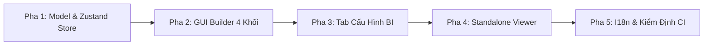

# KẾ HOẠCH TRIỂN KHAI NÂNG CẤP TRÌNH THIẾT KẾ & XUẤT BẢN BÁO CÁO ĐỘNG
## DỰ ÁN: MICRO-REPORT ENGINE (VISUAL DYNAMIC REPORT PLATFORM)

* **Mã tài liệu:** `PLAN-202608-MASCOM-MR-FRONTEND`
* **Phiên bản:** 6.0 — Enterprise Release
* **Ngày cập nhật:** 26/08/2026
* **Đơn vị thực hiện:** Frontend Architecture & UI/UX Team MASCOM / Chapisoft

---

## I. TỔNG QUAN & BẢNG ĐỐI SOÁT KHOẢNG TRỐNG TÍNH NĂNG

### 1.1. Mục Tiêu Nâng Cấp
Nâng cấp toàn diện phân hệ thiết kế báo cáo động theo mô hình **Visual Report Designer**:
1. **Thiết Kế Cấu Trúc Báo Cáo Trực Quan:** Cho phép người dùng kéo thả thiết lập Tiêu đề, Bảng liên kết (JOIN), Cột hiển thị và Hàm tính toán (`SUM`, `COUNT`, `AVG`...).
2. **Thiết Lập Bộ Lọc Trước Truy Vấn:** Thiết lập bộ lọc dữ liệu (`WHERE`) cố định và tham số lọc động (`:dynamicParams`) trước khi truy vấn từ CSDL.
3. **Tùy Biến Trực Quan Hóa BI:** Tự do lựa chọn định dạng hiển thị: Bảng dữ liệu chi tiết (`DataTable`) hoặc Biểu đồ trực quan BI (`Recharts`).
4. **Xuất Bản Màn Hình Chuyên Dụng Cho End-User:** Màn hình `/embed/reports/viewer/[templateCode]` ẩn 100% SQL/Schema, tự sinh form bộ lọc, hỗ trợ KPI Card và xuất file Excel/CSV chuẩn quốc tế.

---

### 1.2. Bảng Đối Soát Hiện Trạng vs. Yêu Cầu Nâng Cấp

| STT | Khối Chức Năng | Hiện Trạng Codebase | Yêu Cầu Nâng Cấp | File Triển Khai Trọng Tâm |
| :---: | :--- | :--- | :--- | :--- |
| **1** | **Metadata Header** | Header chữ tĩnh cơ bản | Thêm ô nhập Tiêu đề, Mã báo cáo, Phân loại danh mục, Chế độ xem mặc định | `ui/VisualGuiBuilder.tsx` |
| **2** | **Visual JOIN Builder** | Chỉ chọn được 1 bảng gốc | Thêm form chọn bảng phụ, kiểu JOIN (`LEFT`/`INNER`), khóa liên kết `ON` | `ui/VisualGuiBuilder.tsx` |
| **3** | **Cột & Tổng Hợp** | Chọn cột danh sách cơ bản | Thêm công thức tính toán (`Formula`), Alias tiếng Việt, sắp xếp STT | `ui/VisualGuiBuilder.tsx` |
| **4** | **Bộ Lọc Dữ Liệu** | Chưa có trên giao diện GUI | Thêm bộ lọc `WHERE` cố định và form tham số động (`:fromDate`, `:toDate`...) | `ui/VisualGuiBuilder.tsx` |
| **5** | **Cấu Hình BI Visual** | Biểu đồ Recharts cơ bản | Bộ chọn loại biểu đồ (Bar, Line, Pie, KPI), map trục X/Y, color theme, Top N | `ui/bi/BiDashboardView.tsx` |
| **6** | **Standalone Viewer** | Trang tĩnh cơ bản | Tự sinh Form lọc động, 4 thẻ KPI tổng hợp, Drill-down, Responsive | `ui/StandaloneReportViewer.tsx` |
| **7** | **Data Model & State** | State phân mảnh | Gom 5 khối cấu hình vào Zustand Store thống nhất, biên dịch 2 chiều GUI $\leftrightarrow$ SQL | `model/useReportBuilderStore.ts` |

---

## II. CHUẨN HÓA DATA MODEL & STATE MANAGEMENT (ZUSTAND)

Toàn bộ cấu hình mẫu báo cáo được gom lại thành một Schema thống nhất trong `src/features/dynamic-builder/model/`:

### 2.1. Khai Báo Data Types (`model/types.ts`)

```typescript
export type AggregationType = 'NONE' | 'SUM' | 'COUNT' | 'COUNT_DISTINCT' | 'AVG' | 'MIN' | 'MAX';
export type JoinType = 'LEFT JOIN' | 'INNER JOIN' | 'RIGHT JOIN';
export type DynamicParamType = 'Date' | 'Dropdown' | 'Text' | 'Number';
export type ChartType = 'BAR' | 'LINE' | 'DONUT' | 'KPI_CARD' | 'PIVOT';

export interface JoinConfig {
  id: string;
  joinType: JoinType;
  secondaryTable: string;
  sourceColumn: string;
  targetColumn: string;
}

export interface SelectedColumnConfig {
  id: string;
  columnName: string;       // VD: u.NAME, cr.COMMISSION_AMOUNT
  alias: string;            // VD: TÊN TỈNH/THÀNH, TỔNG HOA HỒNG
  aggregation: AggregationType;
  dataType: string;         // VARCHAR2, NUMBER, DATE
}

export interface StaticFilterRule {
  id: string;
  logicalOp: 'AND' | 'OR';
  column: string;
  operator: '=' | '!=' | '>' | '<' | 'IN' | 'LIKE' | 'IS NULL';
  value: string;
}

export interface DynamicParamConfig {
  id: string;
  name: string;             // fromDate, toDate, provinceCode
  label: string;            // Từ ngày, Đến ngày, Tỉnh/Thành phố
  type: DynamicParamType;
  defaultValue: string;
  isRequired: boolean;
}

export interface ReportVisualConfig {
  chartType: ChartType;
  chartTitle: string;
  xAxisKey: string;         // Trục hoành (Dimension): u.NAME
  yAxisKey: string;         // Trục tung (Metric): SUM(cr.COMMISSION_AMOUNT)
  showValueLabel: boolean;
  showGrid: boolean;
  colorPalette: 'corporate' | 'emerald' | 'sunset';
  numberFormat: 'compact' | 'full';
  currencyUnit: string;     // VNĐ, USD
}

export interface ReportTemplateConfig {
  title: string;
  templateCode: string;
  description: string;
  category: string;
  defaultViewMode: 'BOTH' | 'CHART' | 'TABLE';
  mainTable: string;
  joins: JoinConfig[];
  selectedColumns: SelectedColumnConfig[];
  staticFilters: StaticFilterRule[];
  dynamicParams: DynamicParamConfig[];
  visualConfig: ReportVisualConfig;
}
```

### 2.2. Zustand Store Actions (`model/useReportBuilderStore.ts`)
* **Metadata Actions:** `updateMetadata(fields)`
* **Join Actions:** `addJoin(join)`, `removeJoin(id)`, `updateJoin(id, field, value)`
* **Column Actions:** `addColumn(col)`, `removeColumn(id)`, `updateColumnAlias(id, alias)`, `updateAggregation(id, agg)`
* **Filter Actions:** `addStaticFilter(filter)`, `removeStaticFilter(id)`, `addDynamicParam(param)`, `removeDynamicParam(id)`
* **Visual Actions:** `updateVisualConfig(config)`
* **Compiler Function:** `compileGuiToSql()` tự động đồng bộ 2 chiều sang Monaco SQL Editor theo đúng Database Dialect (Oracle / PostgreSQL).

---

## III. ĐẶC TẢ CHI TIẾT 3 MÀN HÌNH CHỨC NĂNG

### 1. KHUNG 1: TRÌNH THIẾT KẾ BÁO CÁO (`VisualGuiBuilder.tsx`)
Bao gồm 4 khối cấu hình xếp chồng tuần tự:

#### 🔹 Khối 1: Thông Tin Báo Cáo (Metadata Header)
* Ô nhập **Tiêu đề báo cáo** (Bắt buộc).
* Ô nhập **Mã báo cáo** (Bắt buộc, tự động chuẩn hóa `UPPERCASE_SNAKE_CASE`).
* Dropdown **Phân loại danh mục** (Tài chính & Doanh thu, Báo cáo Đơn vị, Nghiệp vụ Hồ sơ...).
* Dropdown **Chế độ xem mặc định** (Hỗn hợp, Chỉ biểu đồ, Chỉ bảng số liệu).

#### 🔹 Khối 2: Bảng Dữ Liệu & Liên Kết (JOIN Builder)
* Dropdown chọn **Bảng dữ liệu chính (Root Table)** từ Schema Tree.
* Nút **`+ Thêm Bảng Liên Kết (JOIN)`**.
* Danh sách dòng JOIN:
  * Kiểu JOIN (`LEFT JOIN` / `INNER JOIN` / `RIGHT JOIN`).
  * Chọn Bảng phụ liên kết.
  * Khóa liên kết: `[Cột Bảng Chính] = [Cột Bảng Phụ]`.
  * Nút Xóa dòng liên kết 🗑️.

#### 🔹 Khối 3: Cột Hiển Thị & Hàm Tổng Hợp
* Bảng DataTable hiển thị các cột được chọn từ cây Schema Tree.
* Mỗi dòng bao gồm:
  * Nút kéo sắp xếp thứ tự (Drag handle ⠿).
  * Tên cột gốc (`table.column`).
  * Ô nhập **Bí danh (Alias tiếng Việt)** có dấu.
  * Dropdown **Hàm tổng hợp** (`NONE`, `SUM`, `COUNT`, `AVG`, `MIN`, `MAX`).
  * Badge định dạng kiểu dữ liệu (`VARCHAR`, `NUMBER`, `DATE`).
  * Nút Xóa cột 🗑️.
* Nút **`+ Thêm Cột Tính Toán (Formula)`** (VD: `cr.COMMISSION_AMOUNT * 0.1`).

#### 🔹 Khối 4: Bộ Lọc Dữ Liệu Trước Truy Vấn (WHERE & Dynamic Parameters)
* **Cột trái (Điều kiện WHERE cố định):**
  * Toán tử logic `AND` / `OR`.
  * Tên cột lọc.
  * Toán tử so sánh (`=`, `!=`, `>`, `<`, `IN`, `LIKE`, `IS NULL`).
  * Giá trị lọc cố định.
* **Cột phải (Tham số lọc động cho người xem):**
  * Tên biến tham số (`:fromDate`, `:toDate`, `:provinceCode`...).
  * Nhãn hiển thị thân thiện (Từ ngày, Đến ngày, Tỉnh/Thành phố).
  * Kiểu nhập liệu (`Date`, `Dropdown`, `Text`, `Number`).
  * Giá trị mặc định & Checkbox Bắt buộc.

---

### 2. KHUNG 2: CẤU HÌNH TRỰC QUAN BI (`BiDashboardView.tsx`)

* **Cột trái (Bộ chọn cấu hình):**
  * Chọn 4 kiểu biểu đồ: **Cột (Bar)**, **Đường (Line)**, **Tròn (Pie/Donut)**, **Thẻ KPI (Card)**.
  * Dropdown chọn **Trục X (Dimension)** và **Trục Y (Metric)**.
  * Chọn Bảng màu chủ đề: *Corporate Blue*, *Emerald Green*, *Sunset Orange*.
  * Bộ lọc nhanh số lượng dữ liệu: `Top 10`, `Top 20`, `Top 50`, `Tất cả`.
* **Khung giữa (Live Chart Canvas):**
  * Render biểu đồ Recharts cập nhật tức thì theo cấu hình.
  * Tự động giãn bước nhãn (auto-interval) và rút gọn tên dài để chống rối nhãn.
* **Cột phải (Tùy chọn hiển thị nâng cao):**
  * Checkbox bật/tắt **Nhãn giá trị (Data Labels)**.
  * Checkbox bật/tắt **Đường lưới (Grid Lines)**.
  * Định dạng số rút gọn (`1.2M`, `500k`) hoặc đầy đủ số thập phân.
  * Đơn vị tiền tệ hiển thị (`VNĐ`, `USD`, `%`).

---

### 3. KHUNG 3: MÀN HÌNH XEM & CHẠY BÁO CÁO CHUYÊN DỤNG (`StandaloneReportViewer.tsx`)

* **Đường dẫn URL:** `/embed/reports/viewer/[templateCode]`
* **Header:** Breadcrumb điều hướng + Tiêu đề báo cáo + Nút **Xuất Excel (.xlsx)** & **Xuất CSV**.
* **Form Lọc Động:** Tự động dựng giao diện bộ lọc dựa trên mảng `dynamicParams` (DatePicker Từ ngày - Đến ngày, Dropdown danh mục) + Nút **Áp Dụng & Chạy Báo Cáo**.
* **Thẻ KPI Dashboard:** Grid 4 ô chỉ số tổng quan (Tổng doanh thu, Tổng hồ sơ, Tỷ lệ thành công...) kèm icon và màu sắc trực quan.
* **Khu Vực Kết Quả (Split / Tab Layout):**
  * *Chế độ Biểu đồ:* Hiển thị Recharts trực quan hóa số liệu.
  * *Chế độ Bảng số liệu:* Bảng DataTable chi tiết, hỗ trợ phân trang, sắp xếp cột và dòng **TỔNG CỘNG** tự động tính toán.
* **Bảo Mật & Trải Nghiệm:** Ẩn 100% mã SQL và Schema CSDL; hiển thị Friendly Error Card tiếng Việt khi có lỗi kết nối.

---

## IV. KẾ HOẠCH PHÂN RÃ CÔNG VIỆC WBS (5 PHA THỰC THI)



| Giai Đoạn (Phase) | Tác Vụ Cụ Thể | File Triển Khai Trọng Tâm | Tiêu Chí Hoàn Thành (DoD) |
| :--- | :--- | :--- | :--- |
| **Phase 1: Model & Store** | Mở rộng Schema Types & Zustand Store lưu trữ 5 khối cấu hình | • `model/types.ts`<br>• `model/useReportBuilderStore.ts` | Store quản lý đủ metadata, joins, columns, filters, visualConfig; hỗ trợ compile 2 chiều GUI $\leftrightarrow$ SQL. |
| **Phase 2: GUI Builder 4 Khối** | Nâng cấp giao diện thiết kế No-Code 4 khối theo bản vẽ chuẩn | • `ui/VisualGuiBuilder.tsx`<br>• `ui/SchemaTreeExplorer.tsx` | Kéo thả chọn cột mượt mà, thêm bớt JOIN, thiết lập bộ lọc WHERE cố định & dynamic params sinh SQL chuẩn. |
| **Phase 3: Tab Cấu Hình BI** | Hoàn thiện bộ chọn biểu đồ Recharts, map trục X/Y, color theme | • `ui/bi/BiDashboardView.tsx`<br>• `ui/bi/DynamicBarChart.tsx`<br>• `ui/bi/DynamicLineChart.tsx` | Đổi loại Chart render ngay lập tức; tối ưu nhãn trục X không bị chồng lấn; lọc Top N dữ liệu. |
| **Phase 4: Standalone Viewer** | Xây dựng trang xem báo cáo độc lập cho End-User | • `ui/StandaloneReportViewer.tsx`<br>• `app/(embed)/embed/reports/viewer/[templateCode]/page.tsx` | Ẩn 100% SQL/Schema; tự sinh Form bộ lọc; render Thẻ KPI + Chart + Table chuẩn 4 cột. |
| **Phase 5: I18n & Kiểm Định CI** | Trích xuất 100% text vào `vi.ts`, kiểm tra typecheck và Local CI | • `shared/locales/vi.ts`<br>• `scripts/local_ci.sh` | `npm run lint` 0 lỗi, TypeScript typecheck PASS, script `local_ci.sh` PASS 100%. |

---

## V. MA TRẬN PHÂN CÔNG TRÁCH NHIỆM (RACI MATRIX)

| Mã Task | Hạng Mục Công Việc | Thực Hiện (R) | Chịu Trách Nhiệm (A) | Tư Vấn (C) | Nhận Thông Tin (I) |
| :---: | :--- | :---: | :---: | :---: | :---: |
| **WBS-F1** | Data Model & Zustand Store Migration | Frontend Lead | Tech Lead | Backend Lead | Dev Team |
| **WBS-F2** | 4-Block Visual GUI Builder UI | Frontend Dev | Frontend Lead | UX Designer | QA Team |
| **WBS-F3** | BI Dashboard Visualization & Recharts | Frontend Dev | Frontend Lead | Data Analyst | QA Team |
| **WBS-F4** | Standalone Viewer & Embed Route | Frontend Dev | Tech Lead | Security Lead | Product Owner |
| **WBS-F5** | I18n Localization & Local CI Testing | QA & Frontend | Tech Lead | DevOps | Toàn Đội |